# 8月16日

## Java异常

### Error：严重系统级错误（如OutOfMemoryError），程序无法处理，无需捕获。

### **Exception**：程序级异常，必须处理。
#### 运行时异常（Unchecked）：继承RuntimeException，编译器不强制处理（如NullPointerException、IndexOutOfBoundsException）。原因是编程逻辑缺陷。

#### 编译时异常（Checked）：继承Exception但不继承RuntimeException，编译器强制处理（如IOException、SQLException）。原因是外部环境问题。

## 关键词
### try-catch-finally：finally块无论如何都会执行（除非System.exit()），用于释放资源。catch块捕获异常。

### throws：声明方法可能抛出异常，交给上层处理。

### throw：手动抛出异常对象。

## 异常处理
**1.捕获异常，记录异常并响应合适的信息给用户**
**用catch提前捕获异常，给合适的信息给用户，防止影响用户体验**
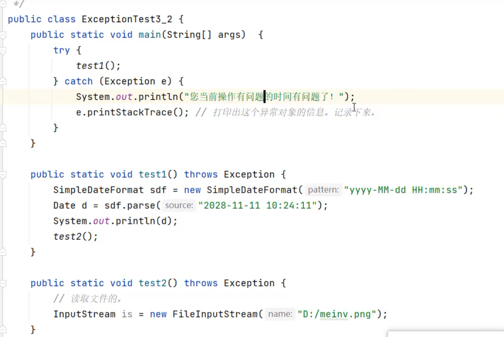

**2.捕获异常，尝试重新修复**
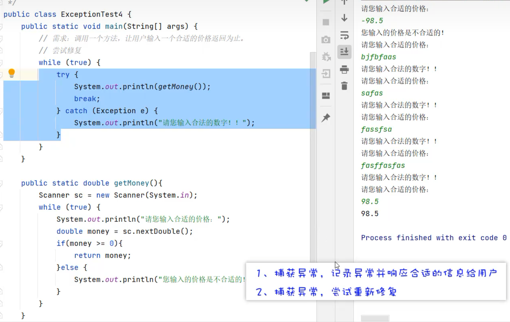

# 8月17日
## html和css，git

稍微复习了一下html和css，大概清楚了大部分内容。也看了一些git的使用方法。
https://heuqqdmbyk.feishu.cn/wiki/G9W0wL5KYiKWrykH8UAcmxnbnuh

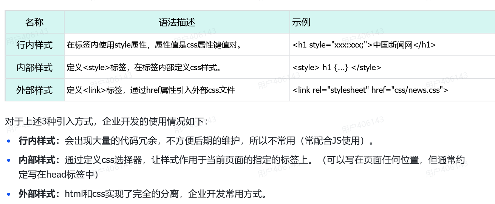

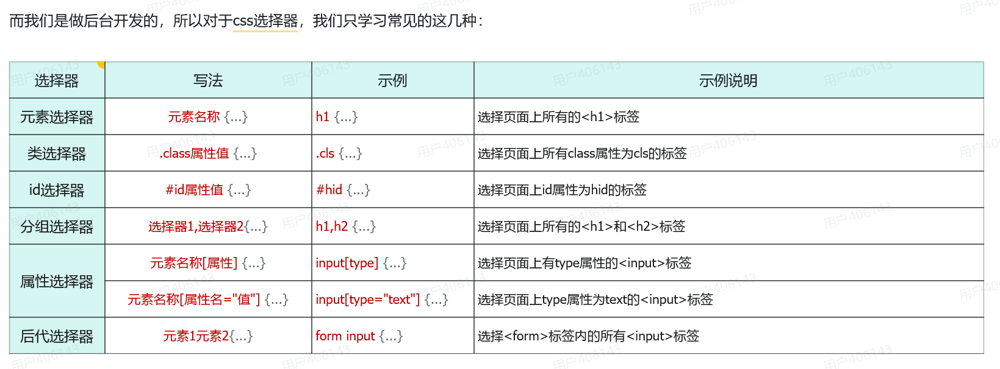

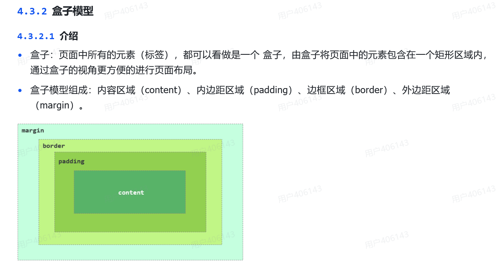

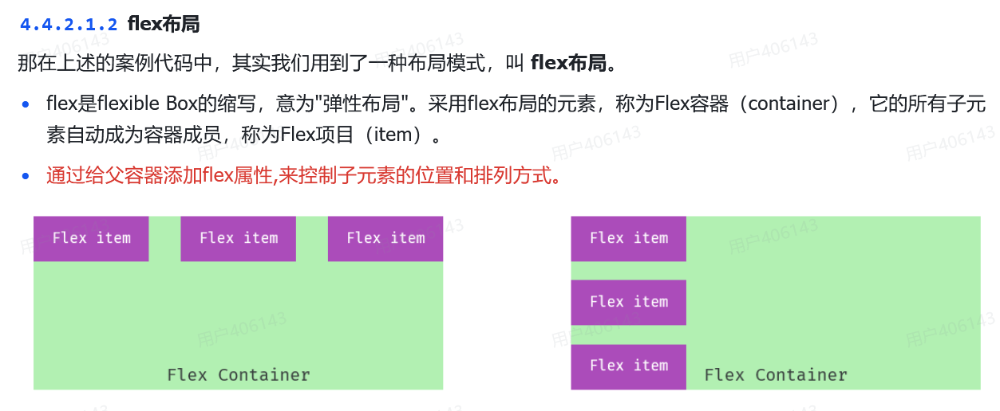

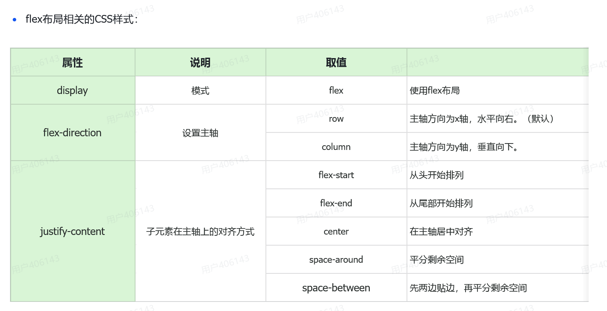

# 8月18日

**学了怎么安装和配置maven**
## Maven的用处
### 1. 管理“依赖”（管 JAR 包）
Java 项目往往需要引用大量第三方的
功能包（JAR 包）。以前你需要去网上下载，再手动复制进项目，特别容易版本冲突。
Maven 的出现让你只需在配置文件（pom.xml）里写上“我要用哪个包、哪个版本”，它会自动去中央仓库下载。

### 2. 标准化“构建”（编译、测试、打包）
它把项目编译、运行单元测试、打包成 JAR/WAR 文件、部署等繁琐步骤，全部标准化成一条命令。
比如你在项目根目录执行 mvn clean install，它就会自动帮你做完“清理旧文件 → 编译代码 → 跑测试用例 → 打包成可执行文件”这一整套流水线操作。

### 3. 统一“项目结构”
Maven 规定了固定的文件夹规则（比如 Java 源码放哪里，配置文件放哪里）。只要遵循这个规则，团队成员或不同的 IDE（如 IDEA、Eclipse）打开项目时都不会乱。

## Maven坐标

### 什么是坐标？
- Maven 中的坐标是资源（jar）的唯一标识，通过该坐标可以唯一定位资源位置。
- 使用坐标来定义项目或引入项目中需要的依赖。

### Maven 坐标主要组成
#### **groupId**：定义当前Maven项目隶属组织名称（通常是域名反写，例如：`com.itheima`）
#### **artifactId**：定义当前Maven项目名称（通常是模块名称，例如：`order-service`、`goods-service`）
 #### **version**：定义当前项目版本号
 - **SNAPSHOT**：**功能不稳定**、尚处于开发中的版本，即快照版本
- **RELEASE**：**功能趋于稳定**、当前更新停止，可以用于发行的版本

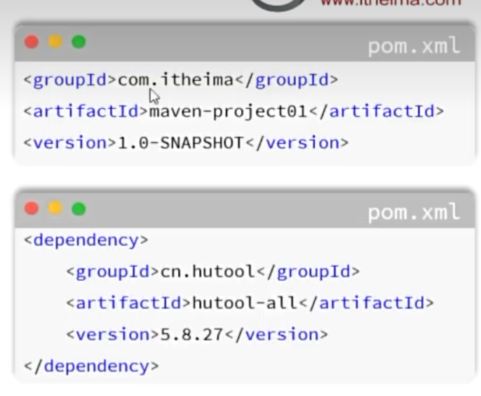

## Maven依赖管理
### 依赖配置
- 依赖：指当前项目运行所需要的jar包，一个项目中可以引入多个依赖。

- 配置：
  1. 在 `pom.xml` 中编写 `<dependencies>` 标签
  2. 在 `<dependencies>` 标签中使用 `<dependency>` 引入坐标
  3. 定义坐标的 `groupId`、`artifactId`、`version`
  4. 点击刷新按钮，引入最新加入的坐标
  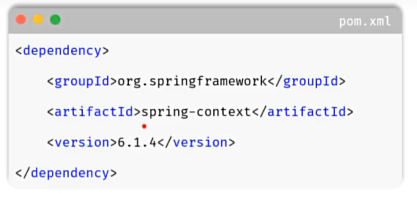
- 如果不知道依赖的坐标信息，可以到 [https://mvnrepository.com/](https://mvnrepository.com/) 中搜索。

### 排除依赖

- 排除依赖：指主动断开依赖的资源，被排除的资源无需指定版本。
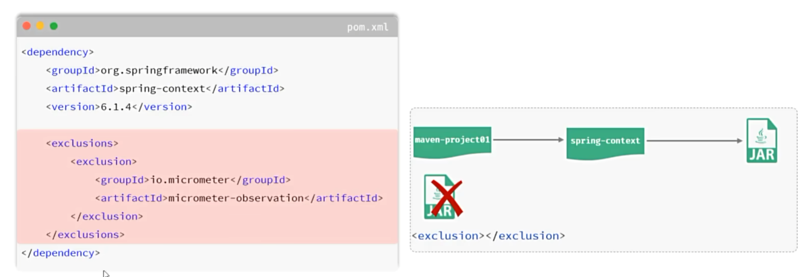

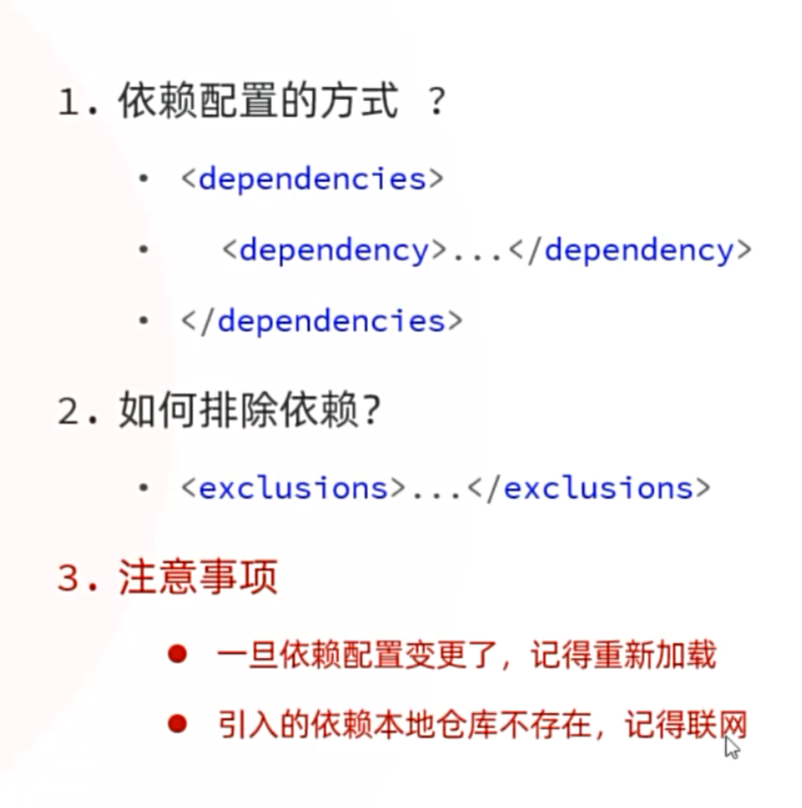

## Maven生命周期

Maven的生命周期就是为了对所有的maven项目构建过程进行抽象和统一。
 
### Maven中有3套相互独立的生命周期：
- **clean**：清理工作。
- **default**：核心工作，如：编译、测试、打包、安装、部署等。
- **site**：生成报告、发布站点等。

每套生命周期包含一些阶段（phase），阶段是有顺序的，后面的阶段依赖于前面的阶段。

### 生命周期阶段
- clean：移除上一次构建生成的文件                         --->属于clean阶段
- compile：编译项目源代码                                     --->属于default阶段
- test：使用合适的单元测试框架运行测试（JUnit）  --->属于default阶段
- package：将编译后的文件打包，如：jar、war等   --->属于default阶段
- install：安装项目到本地仓库                                  --->属于default阶段
#### 注意：
在***同一套生命周期***中，当运行后面的阶段时，前面的阶段都会运行。

### 测试
- 测试：是一种用来促进鉴定软件的正确性、完整性、安全性和质量的过程。
- 阶段划分：单元测试、集成测试、系统测试、验收测试。 
- 测试方法：白盒测试、黑盒测试及灰盒测试。

#### 阶段划分
##### 单元测试
- **介绍**：对软件的基本组成单位进行测试，最小测试单位。
- **目的**：检验软件基本组成单位的正确性。
- **测试人员**：开发人员

##### 集成测试
- **介绍**：将已分别通过测试的单元，按设计要求组合成系统或子系统，再进行的测试。
- **目的**：检查单元之间的协作是否正确。
- **测试人员**：开发人员

##### 系统测试
- **介绍**：对已经集成好的软件系统进行彻底的测试。
- **目的**：验证软件系统的正确性、性能是否满足指定的要求。
- **测试人员**：测试人员

##### 验收测试
- **介绍**：交付测试，是针对用户需求、业务流程进行的正式的测试。
- **目的**：验证软件系统是否满足验收标准。
- **测试人员**：客户/需求方

#### 测试方法
##### 1. 白盒测试
清楚软件内部结构、代码逻辑。
用于验证代码、逻辑正确性。

##### 2. 黑盒测试
不清楚软件内部结构、代码逻辑。
用于验证软件的功能、兼容性、验收测试等方面。

##### 3. 灰盒测试
结合了白盒测试和黑盒测试的特点，既关注软件的内部结构又考虑外部表现（功能）。

#### 单元测试
- 单元测试：就是针对最小的功能单元（方法），编写测试代码对其正确性进行测试。
- JUnit：最流行的Java测试框架之一，提供了一些功能，方便程序进行单元测试（第三方公司提供）。

main方法测试 
1. 测试代码与源代码未分开，难维护
2. 一个方法测试失败，影响后面方法
3. 无法自动化测试，得到测试报告

 JUnit单元测试
1. 测试代码与源代码分开，便于维护
2. 可根据需要进行自动化测试
3. 可自动分析测试结果，产出测试报告

所以用JUnit单元测试。