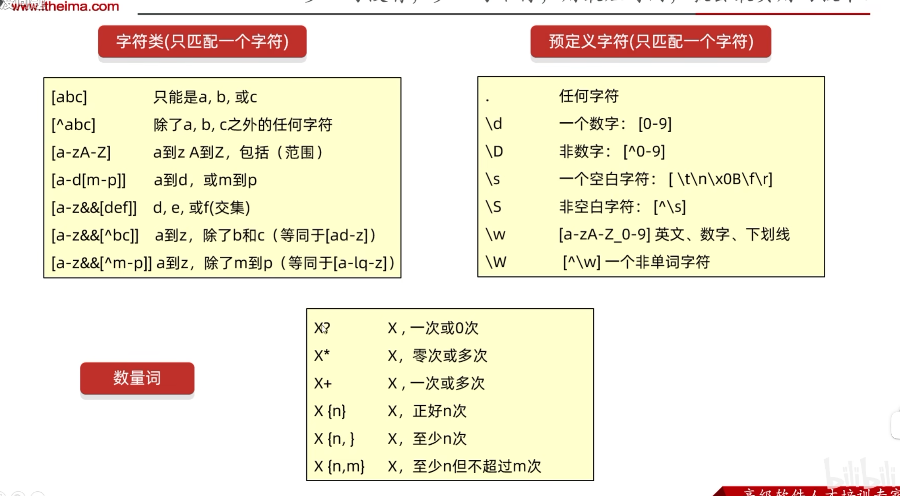
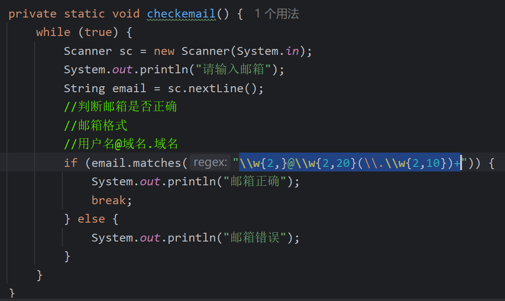
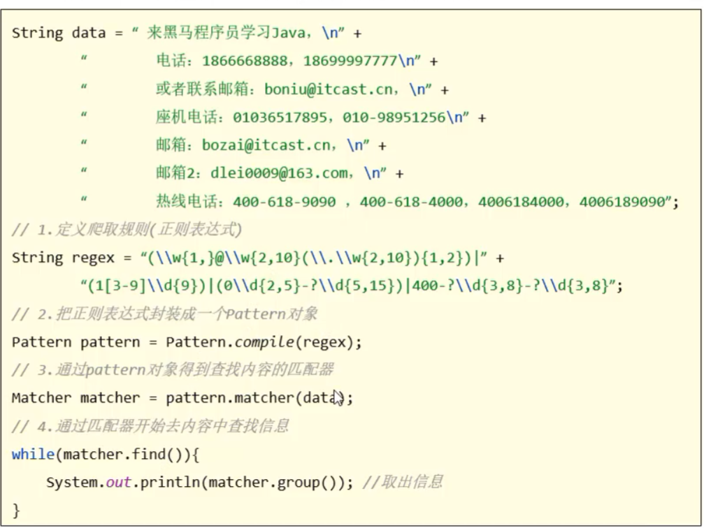
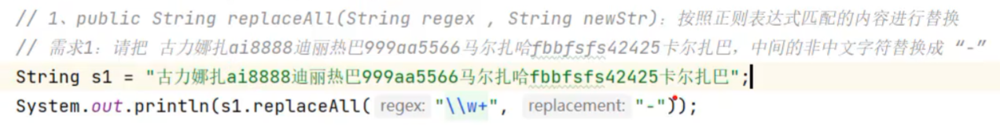
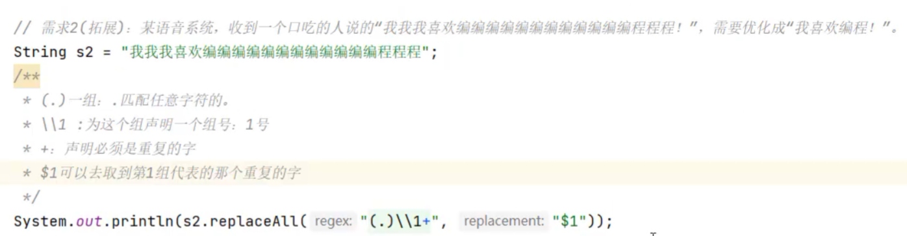
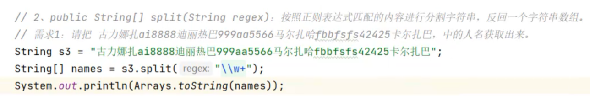

# 功能一：用于校验字符
matches( )

#### 正则表达式

#### (1[3-9]\\\d{9})
#### 1        -->第一位为1
#### [3-9]  -->第二为范围为3到9
#### \\\d{9} -->剩下9位为数字

#### （\\\w{2,}@\\\w{2,20}(\\\\.\\\w{2,10})+）
#### \\\w{2,}--> 至少两位的英文或数字
#### @ -->必须为@
#### \\\w{2,20} -->至少两位，最多二十位的英文或数字
#### (\\\\.\\\w{2,10})+） -->（一点和至少两位，最多十位的英文或数字）， 必须出现一次或多次

# 功能二:在字符串中**查找**下一个匹配子串
爬取信息
find( )

# 功能三
### 搜索替换、分割内容

