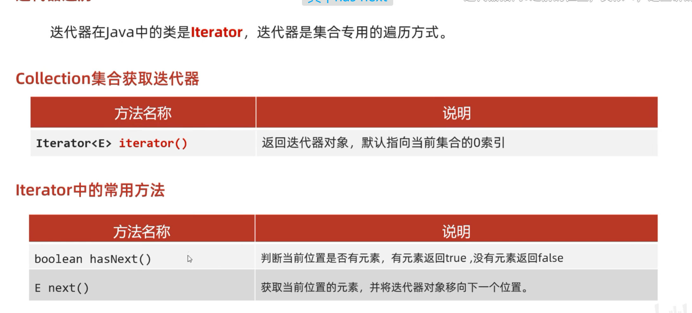
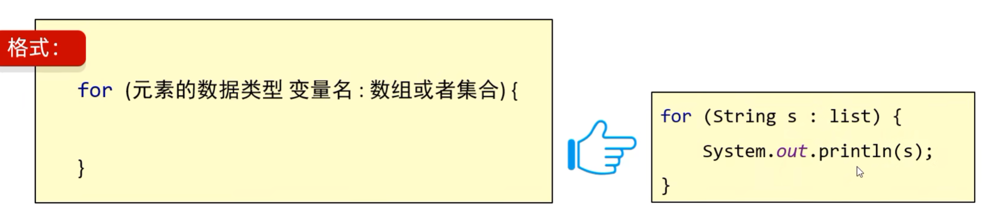

 # 单列集合Collection
## Collection是单列集合的祖宗接口，它的功能是全部单列集合都可以继承使用的。

## Collection常见方法

contains方法细节：
//如果存在自定义对象，没有重写equals方法，那么默认使用Object类中的equals方法进行判断，而Object类中equals方法，依赖地址值进行判断。
//需求：如果同名和同年龄，就认为是同一个学生。
//所以，需要在自定义的Javabean类中，重写equals方法就可以了。

## Collection的遍历方式

### 迭代器遍历

Iterator<String> 变量名 = coll.iterator();-->创建指针
变量名.hasNext() -->判断是否有元素
变量名.next(); -->获取元素  移动指针到下一个

#### 细节注意点：
1. 如果当前位置没有元素，还要强行获取，会报NoSuchElementException
2. 迭代器遍历完毕，指针不会复位      想再次遍历只能再次创建新的迭代器对象
3. 循环中只能用一次next方法             多用容易报错
4. 迭代器遍历时，不能用集合的方法进行增加或者删除  只能用迭代器提供的方法删除  
	暂时没有添加
    it.remove

### 增强for遍历

增强for的底层就是迭代器，为了简化迭代器的代码书写的。
所有的  **==单列集合==**  和  **==数组==**  才能用增强for进行遍历。

增强for里的变量是第三方变量，所以修改增强for中的变量，不会改变集合中原本的数据。

### Lambda表达式遍历
coll.forEach(( s) ->System.out.println(s));

### for遍历只能list能用，因为set没有索引