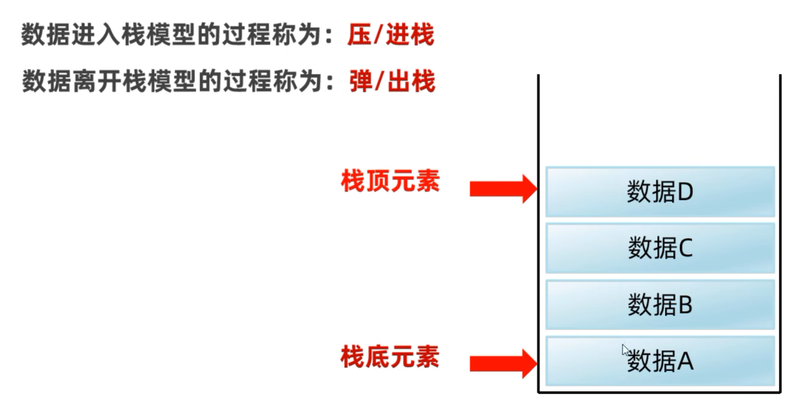
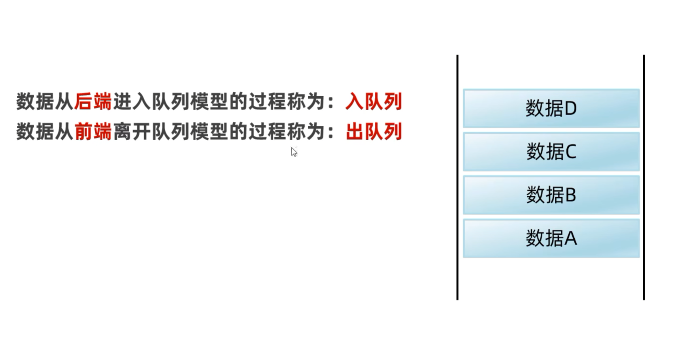
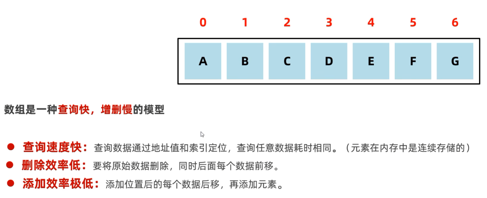
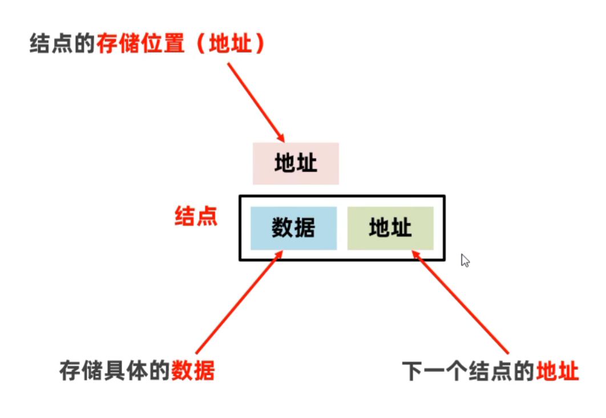
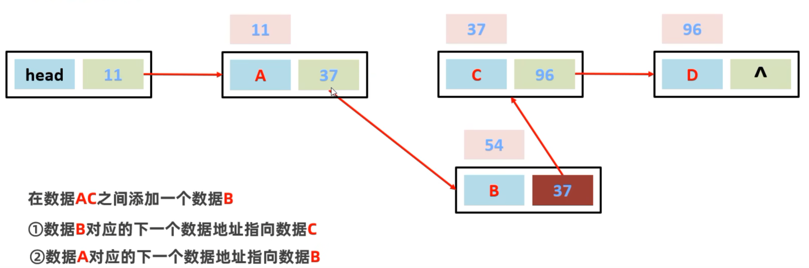
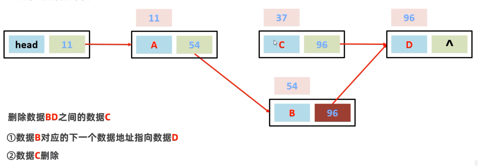
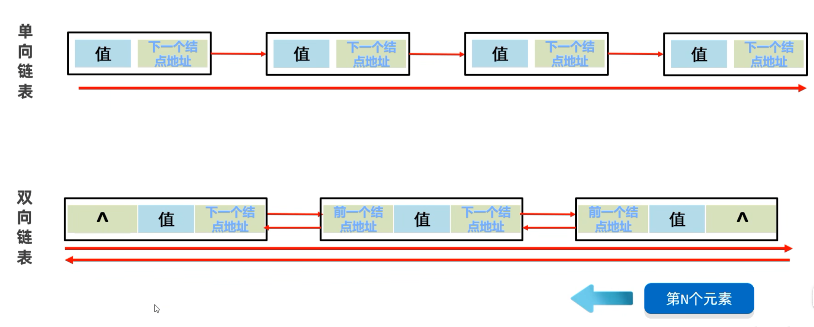

# 数据结构概述

数据结构是计算机底层存储、组织数据的方式。

是指数据相互之间是以什么方式排列在一起的。

数据结构是为了更加方便的管理和使用数据，需要结合具体的业务场景来进行选择。

一般情况下，精心选择的数据结构可以带来更高的运行或者存储效率。

# 常见的**数据结构**

## 1.栈  

栈的特点：后进先出，先进后出

## 2.队列  

队列的特点： 先进先出，后进后出

## 3.数组  

## 4.链表  

链表中的结点是独立的对象，在内存中是不连续的，每个结点包含数据值和下一个结点的地址。

链表查询慢，无论查询哪个数据都要从头开始找。

**链表增删  相对  快**

链表添加：

链表删除：

单双向链表：
双向：可以从尾开始遍历
