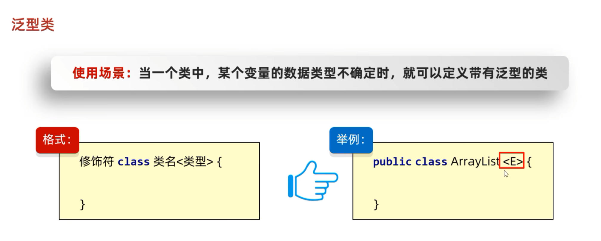
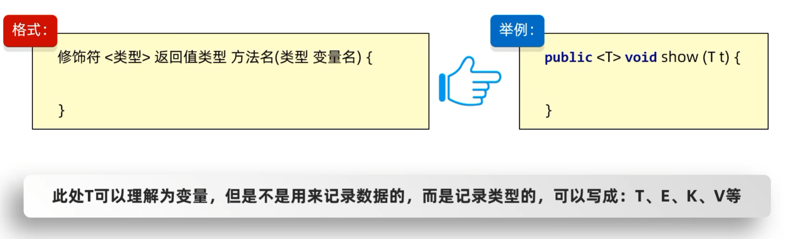
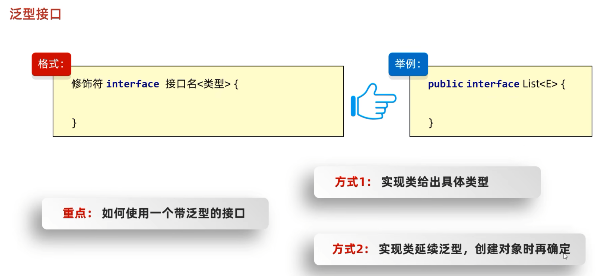
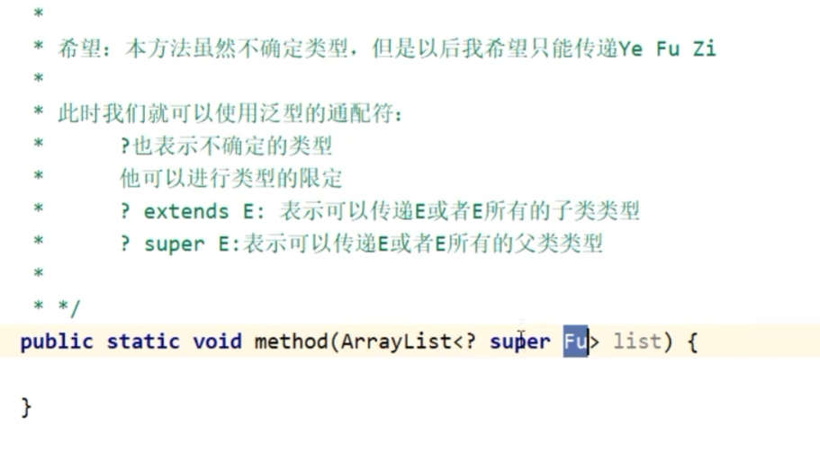
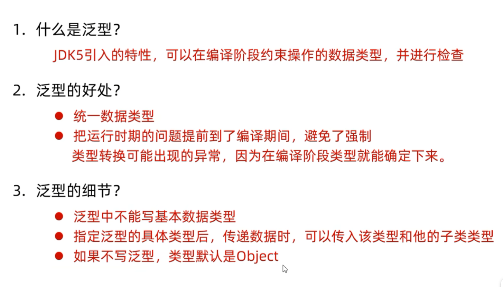
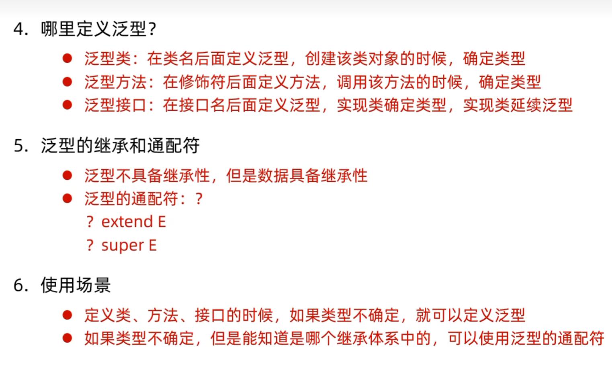

# 泛型概述
泛型：是JDK5中引入的特性，可以在编译阶段约束操作的数据类型，并进行检查。

泛型的格式：<数据类型>

注意：泛型只能支持**==引用数据类型==**。

//没有泛型的时候，集合如何存储数据

//结论：
//如果我们没有给集合指定类型，默认认为所有的数据类型都是Object类型
//此时可以往集合添加任意的数据类型。
//带来一个坏处：我们在获取数据的时候，无法使用他的特有行为。

# 泛型的好处

- 统一数据类型。
- 把运行时期的问题提前到了编译期间，避免了强制类型转换可能出现的异常，因为在编译阶段类型就能确定下来。

扩展知识点：Java中的泛型是伪泛型

# 泛型的细节

- 泛型中不能写基本数据类型  
- **指定泛型的具体类型后**，传递数据时，可以传入该类类型或者其子类类型  
- 如果不写泛型，类型默认是 `Object`

# 泛型类

# 泛型方法

方法中形参类型不确定时，可以使用类名后面定义的泛型<E>

## 方法中形参类型不确定时

### 方案①：使用类名后面定义的泛型  
**所有方法都能用**

### 方案②：在方法申明上定义自己的泛型  
**只有本方法能用**

# 泛型接口

# 泛型的继承和通配符
- 泛型不具备继承性，但是数据具备继承性

* 应用场景：
  1. 如果我们在定义类、方法、接口的时候，如果类型不确定，就可以定义泛型类、泛型方法、泛型接口。
  2. 如果类型不确定，但是能知道以后只能传递某个继承体系中的，就可以泛型的通配符

* 泛型的通配符：
  * 关键点：可以限定类型的范围。

# 总结

