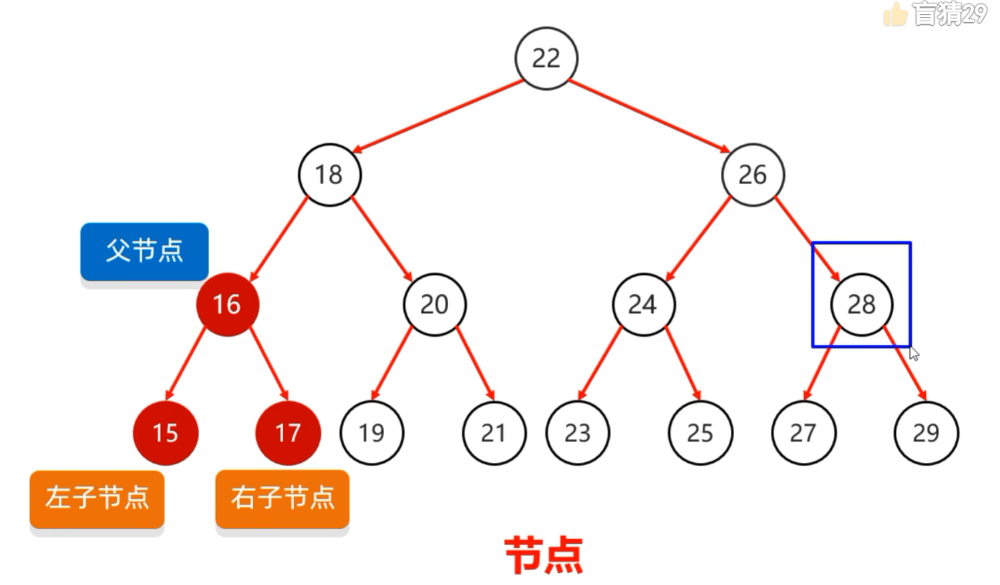
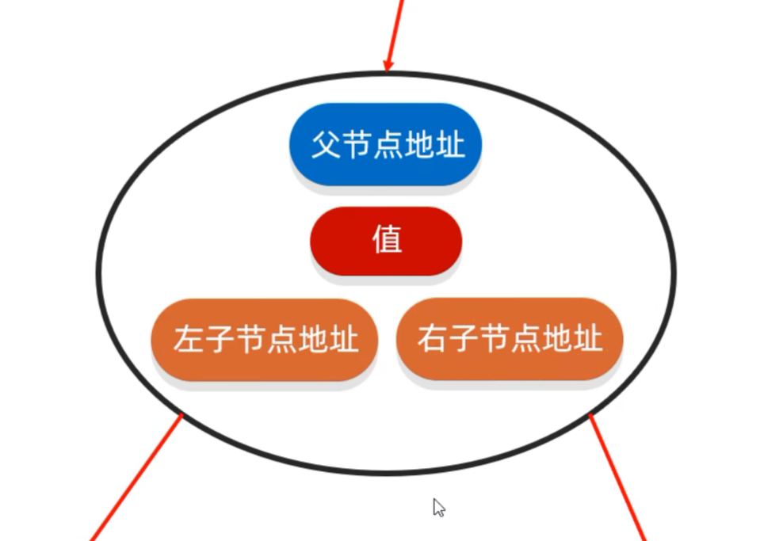
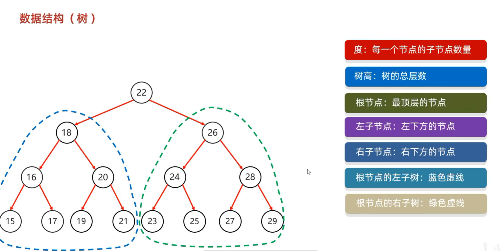
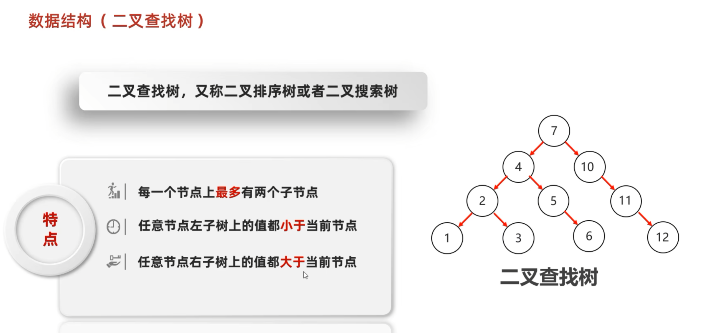
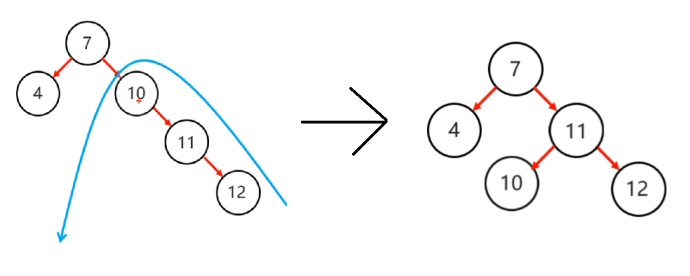
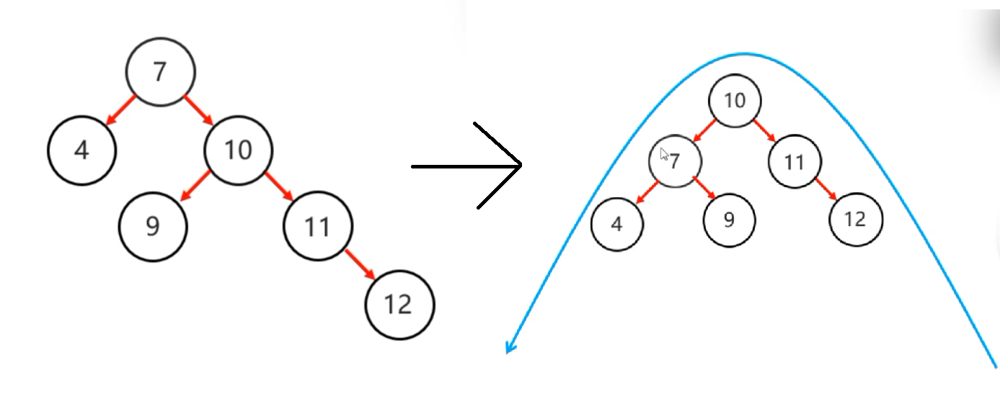

# 1.树
# 树的结构：

# 节点内部结构：

# 树的专业名词：

二叉树中，任意节点的度<=2

# 二叉查找树：

## 数据结构（二叉查找树）添加节点
按照规则将下列节点添加到二叉查找树中
规则：  
小的存在左边  
大的存在右边  
一样的不存

## 数据结构（二叉查找树）查找节点
原理和添加的规则一样
从根节点开始，大的往右找，小的往左找。
一个一个找，直到结束

## 数据结构（二叉树）遍历方式
怎么记：看当前节点什么时候获取，就是什么序遍历
前序遍历就是当前节点再前面获取，然后再左右。
### 1.前序遍历
从根结点开始，然后按照**当前**结点，**左子**结点，**右子**结点的顺序遍历
当前->左->右

### 中序遍历（比较常见）
从最左边的子节点开始，然后按照 **左子** 结点，**当前** 结点，**右子** 结点的顺序遍历
左->当前->右

### 后序遍历
从最左边的子节点开始，然后按照 **左子** 结点、**右子** 结点、**当前** 结点的顺序遍历
左->右->当前

### 层序遍历
从根节点开始一层一层的遍历

## 数据结构（二叉查找树）弊端
因为 插入规则是“小的放左边，大的放右边”，**它不会自动调整结构**。如果你插入的数据本身已经是有序的（从小到大或从大到小），就会出问题。**退化成一条“链表”**（即斜树）
这样就会**操作效率不稳定**

| 弊端            | 说明                                     |
| ------------- | -------------------------------------- |
| **① 退化为链表**   | 插入有序数据时，树变成单支结构，高度为 n                  |
| **② 操作效率不稳定** | 查找、插入、删除的时间复杂度在 O(log n) ~ O(n) 之间剧烈波动 |
| **③ 无法自平衡**   | 标准的 BST 没有“自我修复”机制，不会主动调整树的形状          |
为了弥补这个缺陷，就发明了 **平衡二叉树**

# 平衡二叉树

规则：任意节点左右子树高度差不超过1

## 数据结构（平衡二叉树）旋转机制

### 触发时机：当添加一个节点之后，该树不再是一颗平衡二叉树

### 规则1：左旋

**先确定支点：从添加的节点开始，不断的往父节点找不平衡的节点**

#### 简单情况的步骤（不平衡的点只有一边子节点）：
1.以不平衡的点作为支点

2.把支点左旋降级，变成左子节点

3.晋升原来的右子节点

#### 困难情况的步骤（不平衡的点两边都有子节点）：
1.以不平衡的点作为支点  

2.将根节点的右侧往左拉

3.原先的右子节点变成新的父节点，并把多余的左子节点出让，给已经降级的根节点当右子节点

### 规则2：右旋
 
**先确定支点：从添加的节点开始，不断的往父节点找不平衡的节点**

#### 简单情况的步骤（不平衡的点只有一边子节点）：
1.以不平衡的点作为支点

2.把支点右旋降级，变成右子节点

3.晋升原来的左子节点

#### 困难情况的步骤（不平衡的点两边都有子节点）：
1.以不平衡的点作为支点  

2.将根节点的右侧往左拉

3.原先的右子节点变成新的父节点，并把多余的左子节点出让，给已经降级的根节点当右子节点

## 数据结构（平衡二叉树）需要旋转的四种情况

### 1.左左
当根节点左子树的左子树有节点插入，导致二叉树不平衡

一次右旋

### 2.左右
当根节点左子树的右子树有节点插入，导致二叉树不平衡

先局部左旋，再整体右旋
局部左旋把左右的情况变成左左情况

### 3.右右
右右：当根节点右子树的右子树有节点插入，导致二叉树不平衡

一次左旋

### 4.右左
右左：当根节点右子树的左子树有节点插入，导致二叉树不平衡

先局部右旋，再整体左旋
局部右旋把右左的情况变成右右情况