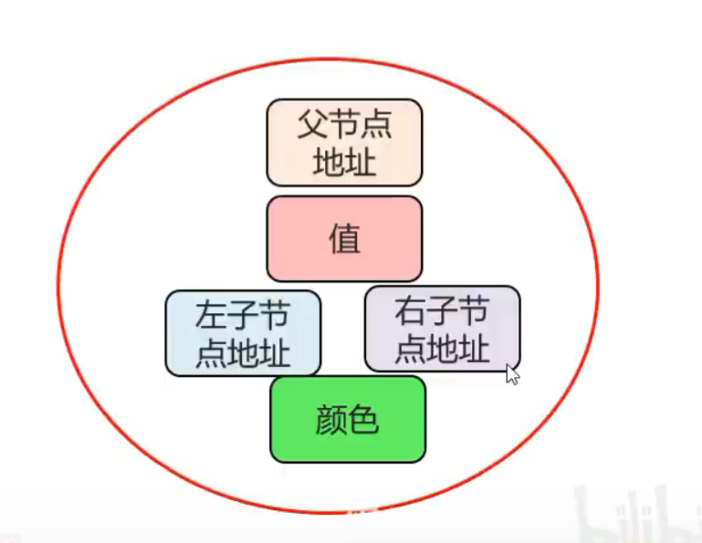
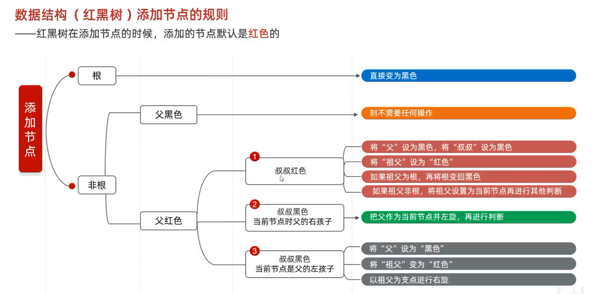
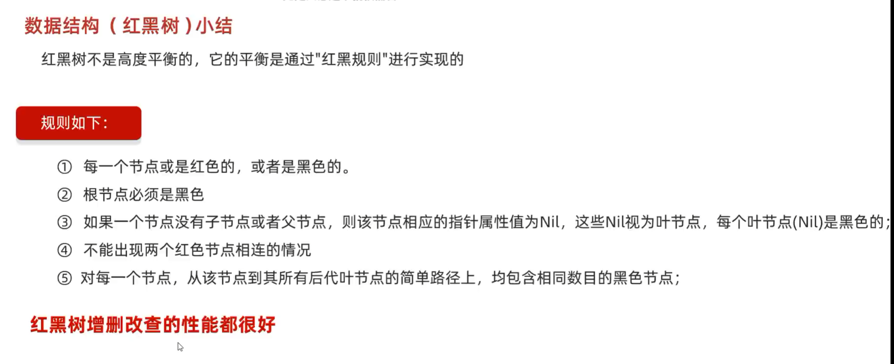

# 红黑树：

- 是一个二叉查找树：
    
- 但是不是高度平衡的
    
- 条件：**特有的红黑规则**

# 数据结构（红黑树）红黑规则

1. 每一个节点或是红色的，或者是黑色的
    
2. 根节点必须是黑色
    
3. 如果一个节点没有子节点或者父节点，则该节点相应的指针属性值为Nil，这些Nil视为叶节点，每个叶节点(Nil)是黑色的
    
4. 如果某一个节点是红色，那么它的子节点必须是黑色（不能出现两个红色节点相连的情况）
    
5. 对每一个节点，从该节点到其所有后代叶节点的简单路径上，均包含相同数目的黑色节点

红黑树的内部结构：

红黑树添加规则：

