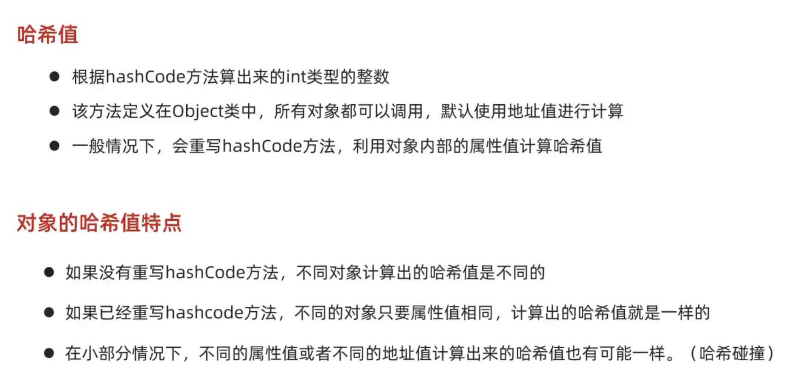
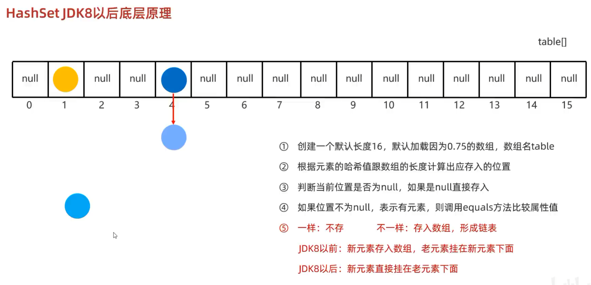
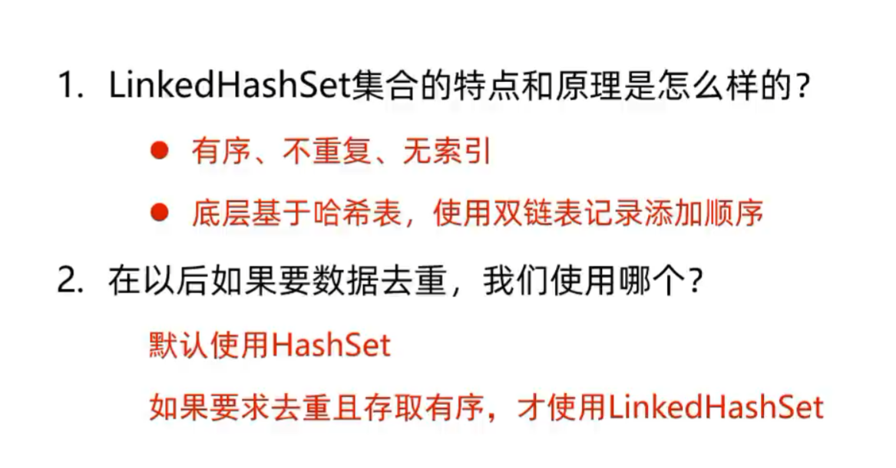
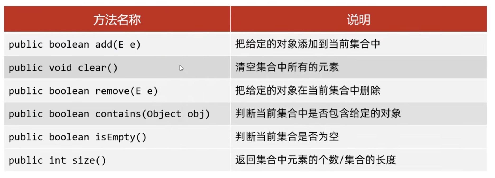

## Set -- 添加的元素是无序的、不重复、无索引

- 无序：存取顺序不一致
    
- 不重复：可以去除重复
    
- 无索引：没有带索引的方法，所以不能使用普通for循环遍历，也不能通过索引来获取元素

 # Set集合的实现类

## HashSet：无序、不重复、无索引
### HashSet底层原理

- HashSet集合底层采取**哈希表**存储数据
    
- 哈希表是一种对于增删改查数据性能都较好的结构
    

哈希表组成

- JDK8之前：数组+链表
    
- JDK8开始：数组+链表+红黑树

哈希值：对象的整数表现形式

JDK8以后，当链表长度 **超过8**，而且数组长度 **大于等于64** 时，自动转换为红黑树

如果集合中存储的是自定义对象，必须要重写 **hashCode** 和 **equals** 方法

### HashSet的三个问题

**问题1**: HashSet为什么存和取的顺序不一样？
1. **存的时候看哈希值**：元素添加时，根据`hashCode()`计算哈希值，再映射到数组的某个位置（桶）存放，所以元素在底层是分散存储的，与添加顺序无关。
    
2. **取的时候看数组下标**：遍历时从数组索引0开始依次往后查，先取哪个桶、再取桶里的链表/红黑树，完全取决于数组下标顺序。

**问题2**: HashSet为什么没有索引？
哈希表把元素散乱存放，**物理上没有“第几个”的概念**；加上索引会**拖慢性能**；且Set本来就不需要靠位置找元素。所以设计者直接取消了索引，让遍历只能靠迭代器或增强for。

**问题3**: HashSet是利用什么机制保证数据去重的？
**先靠 `hashCode()` 找“房间”，再用 `equals()` 比“长相”，两者配合保证绝对不重复。**

### LinkedListSet：**有序**、不重复、无索引

- **有序**、不重复、无索引。
    
- 这里的有序指的是保证存储和取出的元素顺序一致。
    
- **原理**：底层数据结构是依然哈希表，只是每个元素又额外的多了一个双链表的机制记录存储的顺序。

## TreeSet：**可排序**、不重复、无索引

# Set接口中的方法上基本上与Collection的API一致。

