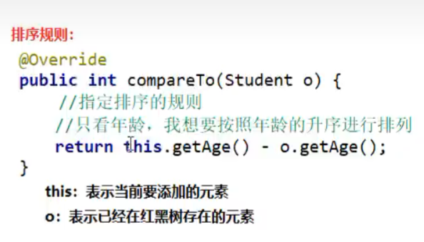
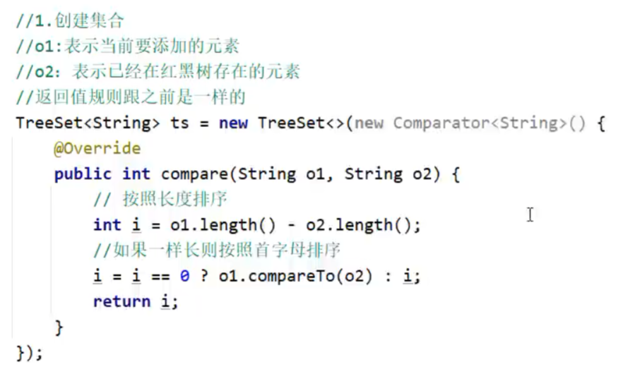
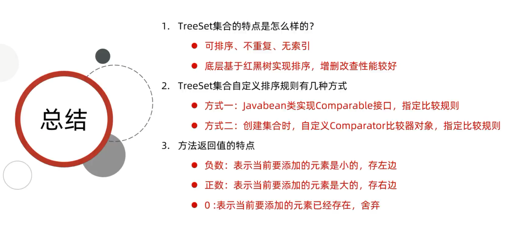
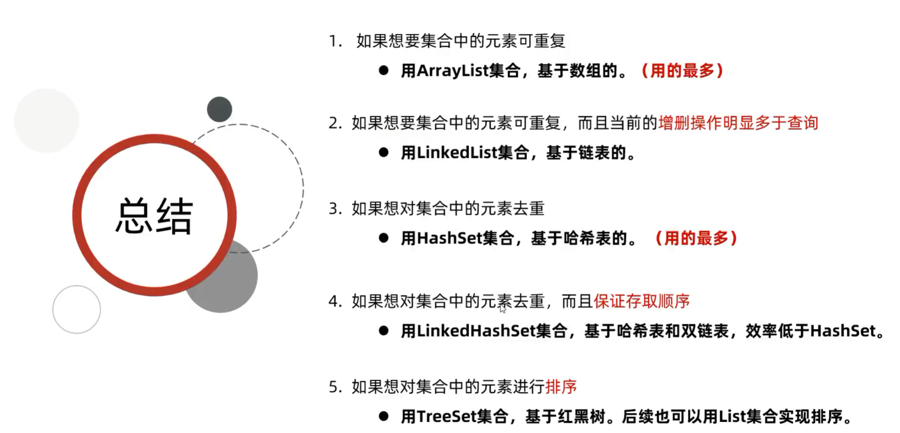

# TreeSet：**可排序**、不重复、无索引
**TreeSet的特点**

- 不重复、无索引、**可排序**
    
- 可排序：按照元素的默认规则（有小到大）排序。
    
- TreeSet集合底层是基于**红黑树**的数据结构实现排序的，增删改查性能都较好。

# **TreeSet集合默认的规则**

- 对于数值类型：Integer, Double，默认按照从小到大的顺序进行排序。
    
- 对于字符、字符串类型：按照字符在ASCII码表中的数字升序进行排序。

# **TreeSet的两种比较方式**

- **方式一**：
    
    - 默认排序/自然排序：JavaBean类实现Comparable接口指定比较规则
     

 - 方式二：
	 
	 - 比较器排序：创建TreeSet对象时候，传递比较器Comparator指定规则
		当方式一不能用时，用方式二
	 

 
 
 **使用原则：默认使用第一种，如果第一种不能满足当前需求，就使用第二种**

- **Comparable（方式一）**：适合让类的对象本身就具有默认的比较能力（比如`Integer`、`String`内部都实现了它），代码写死在类里。
    
- **Comparator（方式二）**：适合临时指定某种特定的排序规则（比如按字符串长度、按对象的某个特定属性等），或者当我们需要修改排序规则但不想修改原有类的源码时使用。

 

使用场景总结

