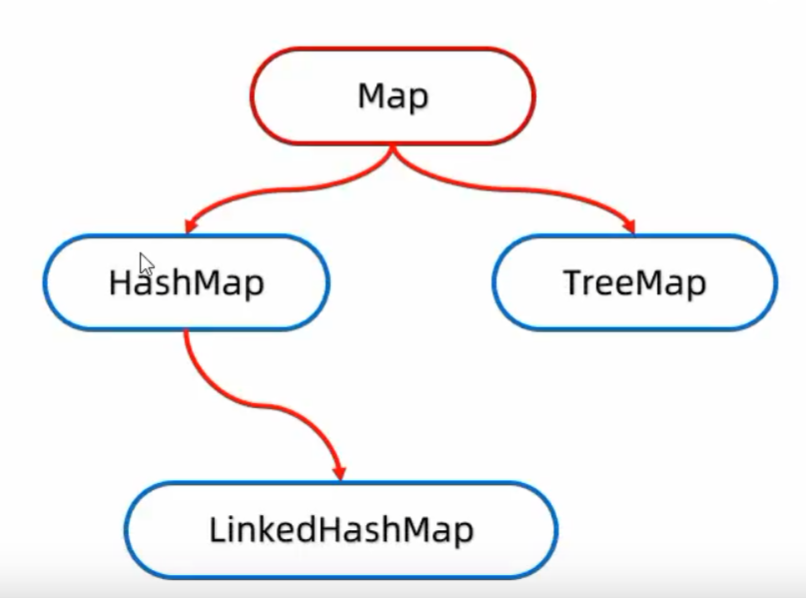
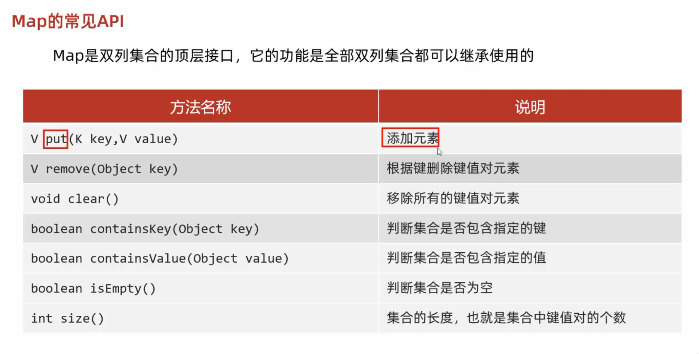
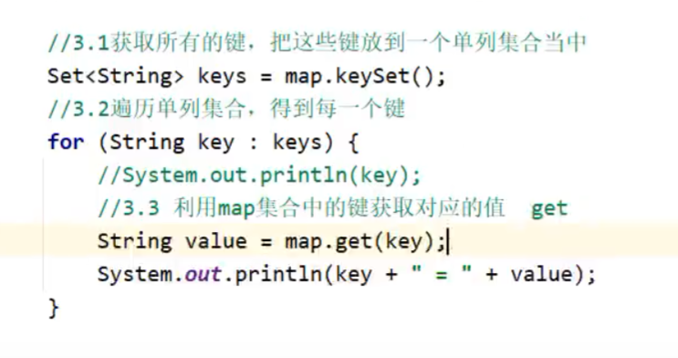
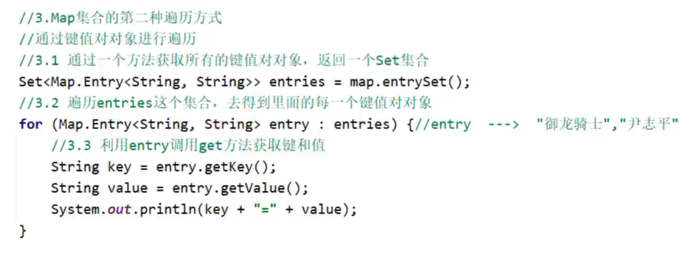
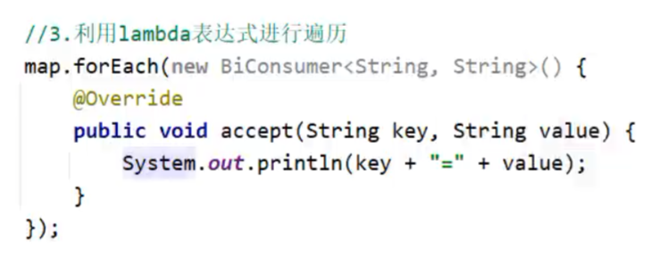
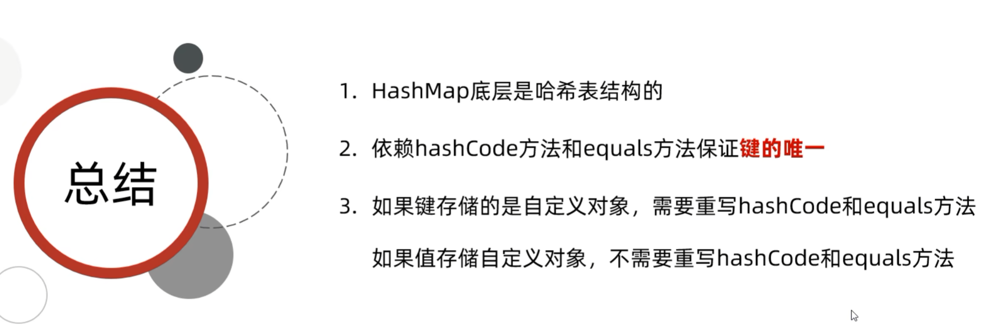

# 双列集合的特点

1. 双列集合一次需要存一对数据，分别为键和值
    
2. 键不能重复，值可以重复
    
3. 键和值是一一对应的，每一个键只能找到自己对应的值
    
4. 键 + 值这个整体我们称之为“键值对”或者“键值对对象”，在Java中叫做“Entry对象”

双列集合的结构

Map常见API

put方法的细节：  
添加/覆盖  
在添加数据的时候，如果键不存在，那么直接把键值对象添加到map集合当中，方法返回null  
在添加数据的时候，如果键是存在的，那么会把原有的键值对象覆盖，会把被覆盖的值进行返回。

# Map的遍历方式
## 1. 键找值
先获取所有键的集合，再遍历键，通过键获取对应的值。
**注意**：这种方式需要先取键、再根据键去查值，相当于访问了两次Map，性能相对较低。

## 2. 键值对
直接获取所有“键值对对象（Entry）”的集合，遍历时同时取出键和值。
**优势**：一次遍历同时拿到键和值，无需二次查询，效率最高，是实际开发中最推荐的传统遍历方式。

## 3. Lambda表达式
利用Map接口的`forEach`方法，结合Lambda表达式进行遍历。
**特点**：代码最为简洁优雅，底层基于`BiConsumer`函数式接口实现，适合现代Java开发风格。
 底层:  
forEach其实就是利用第二种方式进行遍历，依次得到每一个键和值  

再调用accept方法

# Map的实现类HashMap
## HashMap的特点

1. HashMap是Map里面的一个实现类。
    
2. 没有额外需要学习的特有方法，直接使用Map里面的方法就可以了。
    
3. 特点都是由键决定的：无序、不重复、无索引
    
4. HashMap跟HashSet底层原理是一样的，都是哈希表结构

# HashMap的子类LinkedHashMap
**LinkedHashMap**

- **由键决定**：有序、不重复、无索引。
    
- 这里的有序指的是保证存储和取出的元素顺序一致
    
- **原理**：底层数据结构是依然哈希表，只是每个键值对元素又额外的多了一个双链表的机制记录存储的顺序。

# Map的实现类TreeMap
**TreeMap**

- TreeMap跟TreeSet底层原理一样，都是红黑树结构的。
    
- 由键决定特性：不重复、无索引、可排序
    
- 可排序：**对键进行排序。**
    
- **注意**：默认按照键的**从小到大进行排序**，也可以自己规定键的**排序规则**
    

---

**代码书写两种排序规则**

- 实现Comparable接口，指定比较规则。
    
- 创建集合时传递Comparator比较器对象，指定比较规则。 
