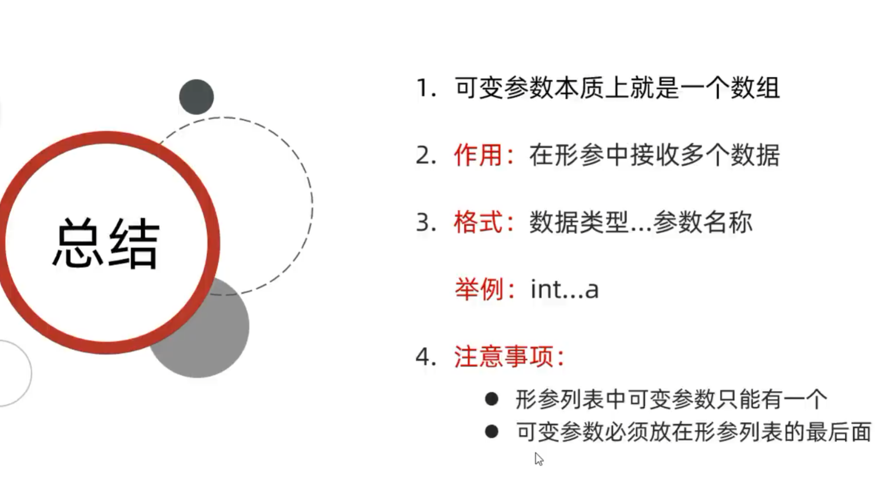
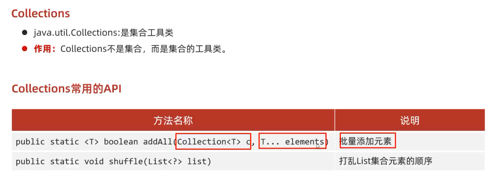
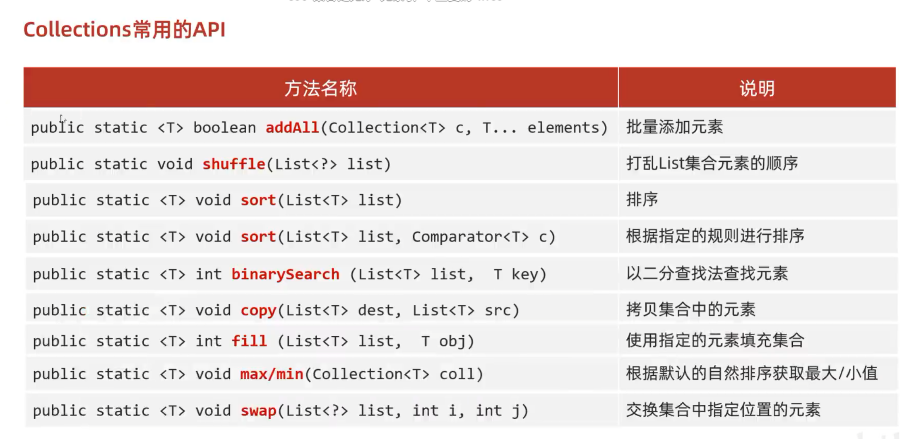

# 可变参数
## 1. 概述

可变参数（Variable-length Arguments，简称 varargs）是 Java 5 引入的一个语法糖，**允许方法接受任意数量的同类型参数**。它使得方法调用更灵活，不再需要显式创建数组或使用多个重载。

## 2. 语法

- 在方法声明中，类型后面加三个点（`...`），后面跟参数名。
    
- 示例：


	```java
    public void printNumbers(int... numbers) {
    // 方法体
    }
    ```

- 调用时，可以传入零个、一个或多个参数，或者直接传入一个数组：

```java
printNumbers();              // 零个
    printNumbers(1);             // 一个
    printNumbers(1, 2, 3);       // 多个
    printNumbers(new int[]{4,5}); // 数组
```

## 3. 使用规则和细节

| 规则             | 说明                                                  |
| -------------- | --------------------------------------------------- |
| **只能有一个可变参数**  | 一个方法最多只能声明一个可变参数。                                   |
| **必须放在参数列表最后** | 可变参数必须位于所有普通参数之后。                                   |
| **本质是数组**      | 编译器将可变参数转换为数组，方法内部可通过数组方式访问。                        |
| **可以传 null**   | 可以显式传入 `null`，但会导致 `NullPointerException` 如果尝试访问元素。 |



# Collections



