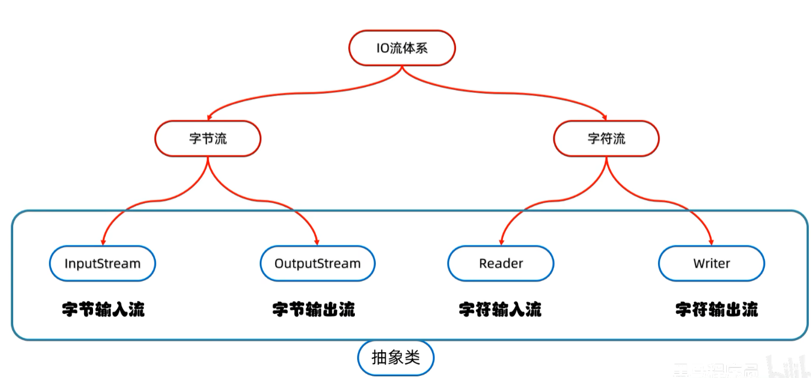
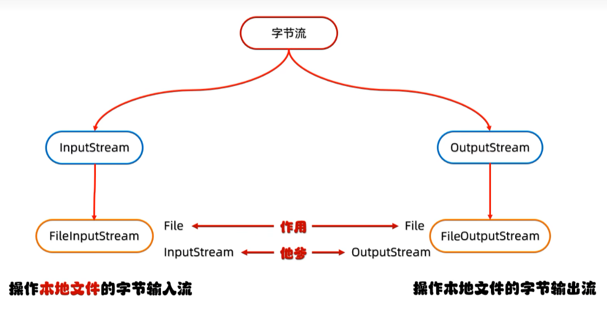

# IO 流

**IO 流**：用于读写文件中的数据（可以读写文件，或网络中的数据…）


# IO 流的分类（两个维度）

## 维度一：按流向

```
           IO 流
          /     \\
     输入流       输出流
     （读取）     （写出）
```

## 维度二：按操作文件类型

```
           IO 流
          /     \\
      字节流      字符流
   所有类型的文件   纯文本文件
```


# IO流体系




# FileOutputStream（文件字节输出流）

**作用**：操作本地文件的字节输出流，可以把程序中的数据写到本地文件中。

---
## 📌 写数据的 3 步流程

| 步骤 | 说明 |
|------|------|
| ① **创建字节输出流对象** | `new FileOutputStream(文件路径)` |
| ② **写数据** | `fos.write(...)` |
| ③ **释放资源** | `fos.close()`（关流）|
```java
import java.io.FileOutputStream;
import java.io.IOException;

public class Test {
    public static void main(String[] args) throws IOException {
        // ① 创建字节输出流对象（路径文件不存在会自动创建）
        FileOutputStream fos = new FileOutputStream("D:\\a.txt");
        // ② 写数据（write 的参数是字节，所以要传 int）
        fos.write(97); // 97 是 'a' 的 ASCII 码，写入的是字符 'a'
        // ③ 释放资源（必须关！否则数据可能没真正写进文件）
        fos.close();
    }
}
```

# 字节输出流的细节

## 1. 创建字节输出流对象

| 细节 | 说明 |
|------|------|
| **细节1** | 参数是**字符串表示的路径**或 **File 对象**都可以 |
| **细节2** | 如果文件不存在会创建新文件，**但要保证父级路径存在** |
| **细节3** | 如果文件已经存在，则**会清空文件**（覆盖写）|

## 2. 写数据

| 细节 | 说明 |
|------|------|
| **关键** | `write` 方法的参数是**整数**，但实际上写到文件里的是这个整数在 **ASCII 上对应的字符**（'9'、'7'、'a'）|

## 3. 释放资源

| 细节 | 说明 |
|------|------|
| **每次用完都要关** | 释放系统资源，否则可能数据没真正写进硬盘 |

# FileOutputStream 写数据的 3 种方式

| 方法名                                      | 说明                 |
| ---------------------------------------- | ------------------ |
| `void write(int b)`                      | 一次写**一个字节**数据      |
| `void write(byte[] b)`                   | 一次写**一个字节数组**数据    |
| `void write(byte[] b, int off, int len)` | 一次写**一个字节数组的部分数据** |
```java
FileOutputStream fos = new FileOutputStream("D:\\a.txt");
byte[] b = {97, 98, 99, 100, 101}; // ASCII: 'a','b','c','d','e'
// 方式1：写一个字节
fos.write(97); // 写入字符 'a'

// 方式2：写整个字节数组
fos.write(b); // 写入 "abcde"（5个字节）

// 方式3：写字节数组的一部分（off=起始下标，len=长度）
fos.write(b, 1, 3); // 从下标1开始写3个 → 写入 "bcd"

fos.close();

// D:\a.txt 最终内容："a" + "abcde" + "bcd" = "aabcde bcd"
```

