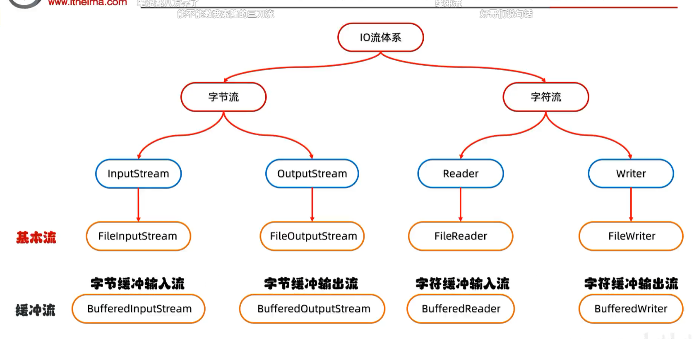

# 字节缓冲流

## 两大类

- **BufferedInputStream** —— **字节缓冲输入流**
- **BufferedOutputStream** —— **字节缓冲输出流**

## 🔥 原理（黑马重点强调）

> **底层自带了长度为 8192 的缓冲区提高性能**

```java
import java.io.*;

// ❌ 普通字节流（慢）
FileInputStream fis = new FileInputStream("a.mp4");
FileOutputStream fos = new FileOutputStream("b.mp4");
int b;
while ((b = fis.read()) != -1) {
    fos.write(b);
}

// ✅ 缓冲流写法（外面包一层 BufferedXxx）
BufferedInputStream bis = new BufferedInputStream(new FileInputStream("a.mp4"));
BufferedOutputStream bos = new BufferedOutputStream(new FileOutputStream("b.mp4"));
int b;
while ((b = bis.read()) != -1) {
    bos.write(b);
}
bis.close();
bos.close();
```

# 缓冲流拷贝多个字节（双重加速）

```java
// 1. 创建缓冲流（外层包 Buffered）
BufferedInputStream bis = new BufferedInputStream(new FileInputStream("a.mp4"));
BufferedOutputStream bos = new BufferedOutputStream(new FileOutputStream("b.mp4"));

// 2. 额外再开一个字节数组，一次读多个字节
byte[] bytes = new byte[1024]; // ⚠️ 这是我们自己加的"小水桶"
int len;
while ((len = bis.read(bytes)) != -1) {
    bos.write(bytes, 0, len); // ⚠️ 只写实际读到的 len 个
}

// 3. 释放资源（只关最外层）
bis.close();
bos.close();
```
