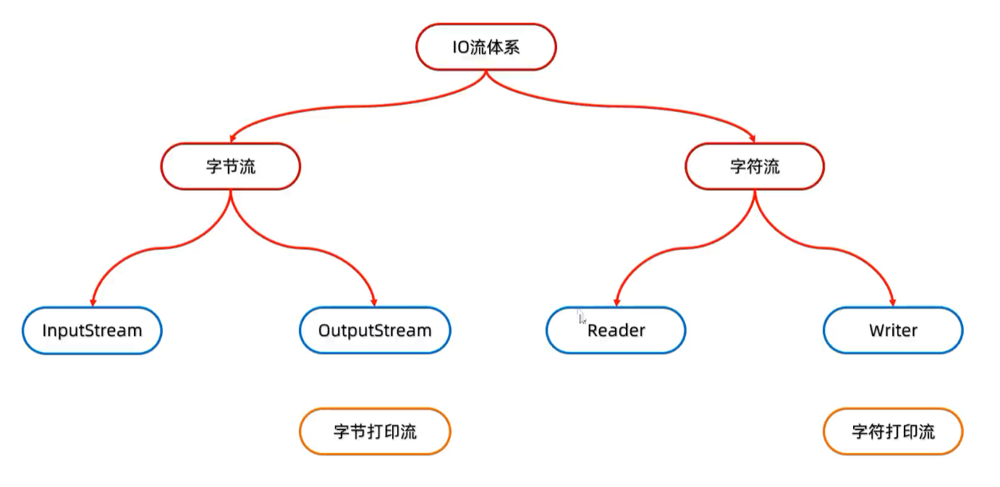

# 打印流 —— 三大特点

## 分类
| 类 | 父类 | 叫法 |
|---|---|---|
| PrintStream | OutputStream | 字节打印流 |
| PrintWriter | Writer | 字符打印流 |

---

## 特点1：只出不进（只有目的地，没有数据源）

打印流**只操作"目的地"**&#8203;（要写到哪个文件），**不操作"数据源"**&#8203;（不从哪读）。

> 大白话：它天生就是**只能写、不能读**的流，所以它没有 read 方法，就是个"输出专用流"。

---

## 特点2：数据原样写出（核心！）

**普通的 write() 是按"字节"写的，打印流的 print() 是按"字符串"写的。**&#8203;

| 代码 | 文件里的结果 |
|---|---|
| `fos.write(97)` | `a` （97 是字符 'a' 的编码值） |
| `ps.print(97)` | `97` |
| `ps.print(true)` | `true` |
| `ps.print(3.14)` | `3.14` |

原理：`print()` 内部先把数据用 `String.valueOf()` **转成字符串**，再按编码写出去 → 所以叫"原样写出"。

---

## 特点3：自动刷新 + 自动换行

**打印一次数据 = 写出 + 换行 + 刷新**

注意区分：
- `print()` —— 只写出，**不换行**
- `println()` —— 写出 + **换行**（自动换行是它干的）

---

## 完整代码演示

```java
public class PrintStreamDemo {
    public static void main(String[] args) throws IOException {
        // 第二个参数 true = 自动刷新（写完自动 flush）
        PrintStream ps = new PrintStream("day11\\a.txt", true);

        ps.print(97);        // 文件：97   （不换行）
        ps.println(true);    // 文件：true + 换行
        ps.println(3.14);    // 文件：3.14 + 换行
        ps.println("你好");   // 文件：你好 + 换行

        ps.close();          // 关流
    }
}
```


# 字节打印流 PrintStream —— 构造方法

| 构造方法 | 说明 |
|---|---|
| `PrintStream(OutputStream/File/String)` | 关联**字节输出流 / File 对象 / 文件路径**（三种目的地任选一种） |
| `PrintStream(String fileName, Charset charset)` | 指定字符编码 |
| `PrintStream(OutputStream out, boolean autoFlush)` | 自动刷新 |
| `PrintStream(OutputStream out, boolean autoFlush, String encoding)` | 指定编码**且**自动刷新 |
**字节流底层没有缓冲区，开不开自动刷新都一样。**


# 字节打印流 PrintStream —— 成员方法

| 成员方法 | 说明 |
|---|---|
| `void write(int b)` | **常规方法**：规则和之前一样，把指定字节写出 |
| `void println(Xxx xx)` | **特有**：打印任意数据，**自动刷新 + 自动换行** |
| `void print(Xxx xx)` | **特有**：打印任意数据，**不换行** |
| `void printf(String format, Object... args)` | **特有**：带占位符的打印语句，**不换行** |

> 后 3 个（println / print / printf）= **数据原样写出**，这就是打印流的"特有"之处。

---

## 三种输出的区别（一张表看懂）

| 方法 | 能否原样写出 | 换行 | 刷新 |
|---|---|---|---|
| `write(int b)` | ❌（按字节写） | 否 | 否 |
| `print(任意)` | ✅ | ❌ | ❌ |
| `println(任意)` | ✅ | ✅ | ✅（autoFlush=true 时） |
| `printf(...)` | ✅（格式化） | ❌ | ✅（autoFlush=true 时） |

**记忆：带 ln 的才换行；只有 println / printf 会自动刷新。**&#8203;

---

## 代码演示

```java
public class Demo {
    public static void main(String[] args) throws IOException {
        PrintStream ps = new PrintStream("day11\\a.txt", true);

        ps.write(97);        // 常规方法 → 文件里是 a（97 是 'a' 的编码）
        ps.print(97);        // 原样写出 → 97（没有换行）
        ps.print("Hello");   // 原样写出 → Hello（接着 97 后面）
        ps.println(true);    // true + 换行
        ps.println(3.14);    // 3.14 + 换行

        // printf：带占位符
        ps.printf("我是%s，今年%d岁，身高%.2f米%n", "张三", 23, 1.75);

        ps.close();
    }
}
```


# 字符打印流 PrintWriter —— 构造方法

| 构造方法 | 说明 |
|---|---|
| `PrintWriter(Writer/File/String)` | 关联**字符输出流 / File 对象 / 文件路径** |
| `PrintWriter(String fileName, Charset charset)` | 指定字符编码 |
| `PrintWriter(Writer w, boolean autoFlush)` | 自动刷新 |
| `PrintWriter(OutputStream out, boolean autoFlush, Charset charset)` | 指定字符编码**且**自动刷新 |

---

## 和字节打印流对照记（关键！）

| | PrintStream（字节） | PrintWriter（字符） |
|---|---|---|
| 目的地参数 | `OutputStream` / `File` / `String` | **`Writer`** / `File` / `String` |
| 底层有没有缓冲 | ❌ 没有 | ✅ **有（8192 字节）**&#8203; |
| autoFlush 有用吗 | 开不开都一样 | ✅ **开着才有意义** |
| 常用场景 | 快速写各种类型数据 | 写文本 + 需要"随时刷新" |

**一句话：构造方法长得几乎一样，区别就在第一个参数从 `OutputStream` 换成了 `Writer`。**&#8203;

---

## 为什么字符打印流必须开自动刷新？

> 课件原话：**字符流底层有缓冲区，想要自动刷新需要开启。**&#8203;

因为 PrintWriter 底层是字符流（FileWriter 内部带 8192 字节缓冲）：

- 数据先写进**缓冲区**，缓冲区没满 → **不落盘**
- 没开启 autoFlush 又忘了 `flush()`，程序结束前打开文件 → **啥都没有**
- 开启 autoFlush 后，`println()` 一调用就自动刷，写完立刻能看到

---

## 代码演示

```java
public class Demo {
    public static void main(String[] args) throws IOException {

        // 方式1：直接给路径（不能自动刷新，需要手动 flush）
        PrintWriter pw1 = new PrintWriter("day11\\a.txt");

        // 方式2：套字符流 + 开启自动刷新 ✅ 最常用
        PrintWriter pw = new PrintWriter(new FileWriter("day11\\a.txt"), true);

        // 方式3：指定编码
        PrintWriter pw2 = new PrintWriter("day11\\a.txt", Charset.forName("UTF-8"));

        // 方式4：套字节流 + 自动刷新 + 编码（JDK10+）
        PrintWriter pw3 = new PrintWriter(
                new FileOutputStream("day11\\a.txt"), true, Charset.forName("UTF-8"));

        pw.println("你好，世界");    // 自动刷新 ✅，立刻落盘
        pw.print("我不换行");        // ⚠️ print 不触发自动刷新
        pw.flush();                  // 保险起见手动刷一下

        pw.close();                  // 关流时也会 flush
    }
}
```


# 字符打印流 PrintWriter —— 成员方法

| 成员方法 | 说明 |
|---|---|
| `void write(...)` | **常规方法**：规则跟之前一样，写出**字节或者字符串** |
| `void println(Xxx xx)` | **特有**：打印任意类型的数据，**并且换行** |
| `void print(Xxx xx)` | **特有**：打印任意类型的数据，**不换行** |
| `void printf(String format, Object... args)` | **特有**：带占位符的打印语句 |

---

## 和字节打印流对比（只差一点点）

| 方法 | PrintStream（字节） | PrintWriter（字符） |
|---|---|---|
| `write(...)` | `write(int b)` 只能写**字节** | 可写 `int` / `char[]` / **`String`** ✅ |
| `print(...)` | 有 | 有（完全一样） |
| `println(...)` | 有 | 有（完全一样） |
| `printf(...)` | 有 | 有（完全一样） |

> **结论：特有方法（print / println / printf）两个类一模一样，唯一区别在 `write()`。**&#8203;
> 字符流的 `write()` 多了一个 `write(String)` 重载 —— 可以直接写字符串。

---

## 代码演示

```java
public class Demo {
    public static void main(String[] args) throws IOException {
        PrintWriter pw = new PrintWriter(new FileWriter("day11\\a.txt"), true);

        pw.write(97);        // 常规：97 按字符解释 → a
        pw.write("你好");     // 常规：直接写字符串（字符流特有！）
        pw.print(97);        // 特有：原样写出 → 97（不换行）
        pw.println(true);    // 特有：true + 换行
        pw.printf("姓名：%s，年龄：%d 岁%n", "张三", 23);

        pw.close();
    }
}

