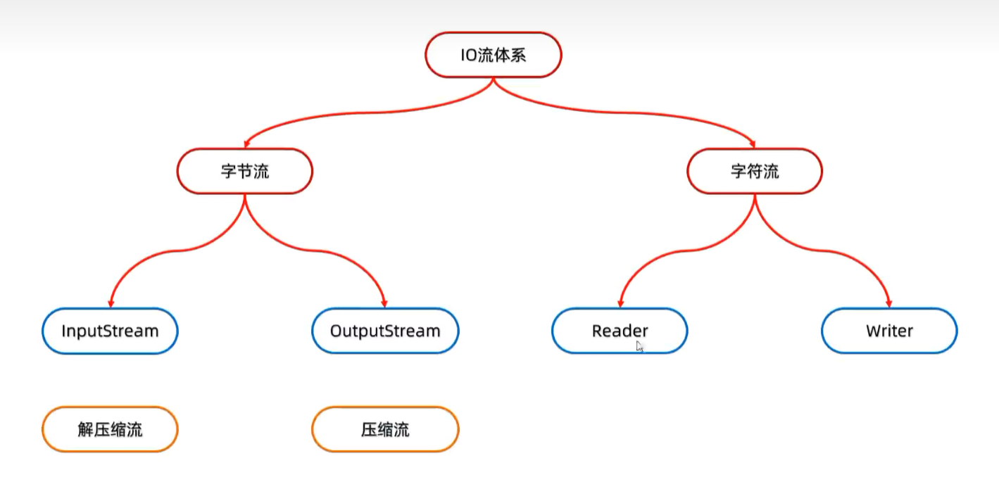

# 压缩流 & 解压缩流（ZipInputStream）

> 解压的**本质**：把压缩包里面的每一个文件或者文件夹读取出来，**按照层级拷贝到目的地当中**。

## 核心对象三件套

| 对象 / 方法 | 作用 |
|---|---|
| `ZipInputStream` | 解压缩流，用来**读取**压缩包中的数据 |
| `ZipEntry` | 压缩包里的**一个条目**（可能是文件夹，也可能是文件） |
| `zip.getNextEntry()` | 取出下一个条目，**返回 null 说明取完了** |
| `entry.isDirectory()` | 判断这个条目是文件夹还是文件 |
| `entry.toString()` | 得到该条目在压缩包内的**相对路径**（如 `aaa/b.txt`） |
| `zip.closeEntry()` | 表示当前条目处理完毕 |
| `zip.close()` | 关闭解压缩流 |

**对比记忆：**

| | 压缩 | 解压 |
|---|---|---|
| 用的流 | `ZipOutputStream` | `ZipInputStream` |
| 核心对象 | `ZipEntry` | `ZipEntry` |

---

## 完整代码（可直接跑）

```java
public class Demo {
    public static void main(String[] args) throws IOException {
        File src = new File("day11\\aaa.zip");   // 要解压的压缩包
        File dest = new File("day11\\");         // 解压到哪
        unzip(src, dest);
    }

    // 定义一个方法用来解压
    public static void unzip(File src, File dest) throws IOException {
        // 1. 创建解压缩流，读取压缩包数据
        ZipInputStream zip = new ZipInputStream(new FileInputStream(src));

        // 2. 循环取出压缩包里的每一个 ZipEntry
        ZipEntry entry;
        while ((entry = zip.getNextEntry()) != null) {
            System.out.println(entry);

            if (entry.isDirectory()) {
                // 是文件夹：在目的地 dest 处创建一个同样的文件夹
                File file = new File(dest, entry.toString());
                file.mkdirs();
            } else {
                // 是文件：读出来，存到目的地 dest 中（按层级目录存放）
                FileOutputStream fos = new FileOutputStream(new File(dest, entry.toString()));
                int b;
                while ((b = zip.read()) != -1) {
                    fos.write(b);
                }
                fos.close();
                // 表示压缩包中的一个文件处理完毕了
                zip.closeEntry();
            }
        }
        zip.close();   // 3. 关流
    }
}
```


# 压缩流 ZipOutputStream（单文件压缩）

> 压缩的**本质**：把文件（或文件夹）的数据，**按照层级写进压缩包**里。

## 核心对象四件套

| 对象 / 方法 | 作用 |
|---|---|
| `ZipOutputStream` | 压缩流，包装 `FileOutputStream`，**目的地是 .zip 文件** |
| `ZipEntry` | 压缩包里的**一个条目**，构造时传"放进包后的路径名" |
| `zos.putNextEntry(entry)` | 把条目**放进压缩包**（相当于在包里"创建文件"） |
| `zos.write(...)` | 把源文件的数据写进压缩包 |
| `zos.closeEntry()` | 当前条目写完了 |
| `zos.close()` | 关闭压缩流（收尾，写出目录信息） |

---

## ⚠️ 最容易踩的坑：`ZipEntry` 的名字

`new ZipEntry("a.txt")` 里的字符串**不是磁盘路径，而是"压缩包内的路径名"**&#8203;！

| 你写 | 压缩包内结构 | 结果 |
|---|---|---|
| `new ZipEntry("a.txt")` | `a.zip/a.txt` | ✅ 正常 |
| `new ZipEntry("aaa/a.txt")` | `a.zip/aaa/a.txt` | ✅ 多一层目录 |
| `new ZipEntry("aaa/")` | `a.zip/aaa/` | ✅ 表示一个目录条目 |
| `new ZipEntry("D:\\a.txt")` | `a.zip/D:\a.txt` | ❌ 带盘符，解压出来目录是乱的 |

💡 **记住两条**：
1. 包内路径**必须用 `/` 分隔**，不能用 `\`
2. **不要带盘符**，`entry` 名字是相对路径

---

## 完整代码

```java
public class Demo {
    public static void main(String[] args) throws IOException {
        // 1.创建File对象表示要压缩的文件
        File src = new File("D:\\a.txt");
        // 2.创建File对象表示压缩包的位置
        File dest = new File("D:\\");
        // 3.调用方法用来压缩
        toZip(src, dest);
    }

    /*
     * 作用：压缩
     * 参数一：表示要压缩的文件
     * 参数二：表示压缩包的位置
     */
    public static void toZip(File src, File dest) throws IOException {
        // 1.创建压缩流关联压缩包（压缩包名字自己起）
        ZipOutputStream zos = new ZipOutputStream(
                new FileOutputStream(new File(dest, "a.zip")));

        // 2.创建ZipEntry对象，表示压缩包里面的每一个文件和文件夹
        ZipEntry entry = new ZipEntry("a.txt");   // ← 包内叫什么名字

        // 3.把ZipEntry对象放到压缩包当中
        zos.putNextEntry(entry);

        // 4.把src文件中的数据写到压缩包当中
        FileInputStream fis = new FileInputStream(src);
        int b;
        while ((b = fis.read()) != -1) {
            zos.write(b);
        }

        // 5.收尾
        zos.closeEntry();
        zos.close();
        fis.close();
    }
}
```

# 压缩文件夹（递归实现）

> 思路：**文件夹不能直接压缩，得先钻进去，把里面的每个文件一个个塞进压缩包。**&#8203;

## 方法签名（三个参数各管一摊）

```java
public static void toZip(File src, ZipOutputStream zos, String name)
```
## 完整代码
```java
public class Demo {
    public static void main(String[] args) throws IOException {
        // 1.要压缩的文件夹
        File src = new File("D:\\aaa");
        // 2.压缩包位置
        File dest = new File("D:\\");

        // 3.创建压缩流（全程只建一次！）
        ZipOutputStream zos = new ZipOutputStream(
                new FileOutputStream(new File(dest, "aaa.zip")));

        // 4.调用递归方法，name 从文件夹名开始
        toZip(src, zos, src.getName());

        // 5.最后统一关闭
        zos.close();
    }

    public static void toZip(File src, ZipOutputStream zos, String name) throws IOException {
        // 1.进入 src 文件夹
        File[] files = src.listFiles();
        // 2.遍历数组
        for (File file : files) {
            if (file.isFile()) {
                // 3.是文件：变成 ZipEntry，放进压缩包
                ZipEntry entry = new ZipEntry(name + "\\" + file.getName());
                zos.putNextEntry(entry);

                // 读取文件数据，写到压缩包
                FileInputStream fis = new FileInputStream(file);
                int b;
                while ((b = fis.read()) != -1) {
                    zos.write(b);
                }

                fis.close();
                zos.closeEntry();
            } else {
                // 4.是文件夹：递归进去
                toZip(file, zos, name + "\\" + file.getName());
            }
        }
    }
}
