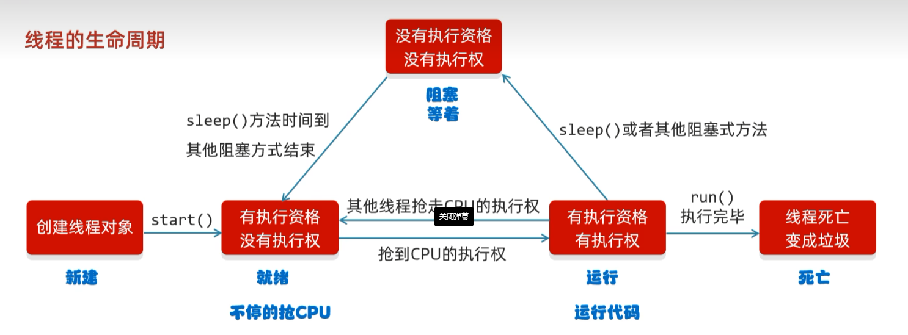

# Thread 常见成员方法

| 方法名称                               | 说明                       |
| ---------------------------------- | ------------------------ |
| `String getName()`                 | 返回此线程的名称                 |
| `void setName(String name)`        | 设置线程的名字（**构造方法也可以设置名字**） |
| `static Thread currentThread()`    | 获取当前线程的对象                |
| `static void sleep(long time)`     | 让线程休眠指定的时间，单位毫秒          |
| `setPriority(int newPriority)`     | 设置线程的优先级                 |
| `final int getPriority()`          | 获取线程的优先级                 |
| `final void setDaemon(boolean on)` | 设置为守护线程                  |
| `public static void yield()`       | 出让线程 / 礼让线程              |
| `public static void join()`        | 插入线程 / 插队线程              |

**setPriority(int newPriority)**：设置完优先级，只提高概率，不一定会优先跑完

---

## 第一眼就该看出的事：分成两栏

| **static 静态方法**（类名直接调） | **实例方法**（先有对象才能调） |
|---|---|
| `Thread.currentThread()` | `getName()` / `setName()` |
| `Thread.sleep(long)` | `getPriority()` / `setPriority(int)` |
| `Thread.yield()` | `setDaemon(boolean)` |
| — | `join()` |

> ⚠️ **这是实现 Runnable 时的分水岭**：静态方法随时能用，实例方法必须先 `Thread.currentThread()` 拿到线程对象。

```java
public class MyRun implements Runnable {
    @Override
    public void run() {
        // ❌ 报错：Runnable 里没有 getName()
        // System.out.println(getName());

        // ✅ 静态方法直接调，拿到对象再调实例方法
        Thread t = Thread.currentThread();
        System.out.println(t.getName());
    }
}
```

---
# 守护线程 setDaemon

| 方法 | 说明 |
|---|---|
| `final void setDaemon(boolean on)` | 设置为守护线程 |

**细节（课件注释）：**
> **当其他的非守护线程执行完毕之后，守护线程会陆续结束。**&#8203;

**通俗易懂：**
> **当女神线程结束了，那么备胎也没有存在的必要了。**&#8203;

非守护线程结束，守护线程不会立刻结束

```java
public class ThreadDemo {
    public static void main(String[] args) {
        MyThread1 t1 = new MyThread1();
        MyThread2 t2 = new MyThread2();

        t1.setName("女神");
        t2.setName("备胎");

        // ⚠️ 把第二个线程设置为守护线程（必须在 start 之前！）
        t2.setDaemon(true);

        t1.start();
        t2.start();
    }
}
```

---

# 礼让线程 yield（出让线程）

| 方法 | 说明 |
|---|---|
| `public static void yield()` | 出让线程 / 礼让线程 |

**课件代码里的注释：** `表示出让当前 CPU 的执行权`

尽可能让线程交替运行，不一定会交替，也可能被抢回CPU 的执行权

---
## 代码（课件版）

```java
public class MyThread extends Thread {
    @Override
    public void run() {
        for (int i = 1; i <= 100; i++) {
            System.out.println(getName() + "@" + i);
            Thread.yield();   // ← 表示出让当前 CPU 的执行权
        }
    }
}
```

---

# 插入线程 join（插队线程）

## 课件原话

| 方法 | 说明 |
|---|---|
| `public final void join()` | 插入线程 / 插队线程 |

**课件代码里的注释：**
```java
// 把t这个线程，插入到当前线程之前。
// t：土豆
// 当前线程：main线程
public class ThreadDemo {
    // ⚠️ join() 会抛 InterruptedException，main 要 throws
    public static void main(String[] args) throws InterruptedException {
        MyThread t = new MyThread();
        t.setName("土豆");
        t.start();           // ⚠️ 必须先启动！

        t.join();            // 把 t 插到当前线程（main）之前

        // 这段一定在土豆跑完 100 次之后才执行
        for (int i = 0; i < 10; i++) {
            System.out.println("main线程" + i);
        }
    }
}
```


# 线程的生命周期（五个状态）

> **一句话总览**：`新建 → 就绪 ⇄ 运行 → 死亡`，中间可以从运行"掉"到阻塞，再回到就绪。

---

## 五个状态 + 四个转移条件

| 状态 | 有没有**执行资格** | 有没有**执行权** | 说明 |
|---|---|---|---|
| **新建** | — | — | 刚 `new` 出来，还没 `start()` |
| **就绪** | ✅ 有 | ❌ 没有 | **不停地抢 CPU** |
| **运行** | ✅ 有 | ✅ **有** | 正在执行 run 里的代码 |
| **阻塞** | ❌ **没有** | ❌ 没有 | 遇到 `sleep()` 等阻塞方法，**等着** |
| **死亡** | — | — | `run()` 执行完毕，**变成垃圾** |

**两个关键词一定要分清：**

| 名词 | 含义 | 类比 |
|---|---|---|
| **执行资格** | 有没有**参与抢 CPU 的权利** | 有没有"排队买票的资格" |
| **执行权** | 有没有**真正在用 CPU** | 有没有"正在窗口前办业务" |

> **就绪 = 排着队但没轮到；运行 = 轮到你了；阻塞 = 被赶出队伍了（连排队的资格都没了）。**&#8203;

---

## 四条转移路径（对应图上的四个箭头）

| 从 → 到 | 触发条件 |
|---|---|
| 新建 → 就绪 | **`start()`** |
| 就绪 → 运行 | **抢到 CPU 的执行权**（OS 调度） |
| 运行 → 就绪 | **被别的线程抢走执行权**（时间片用完） |
| 运行 → 阻塞 | **`sleep()` 或者其他阻塞式方法** |
| 阻塞 → 就绪 | **`sleep()` 时间到 / 其他阻塞方式结束** |
| 运行 → 死亡 | **`run()` 执行完毕** |

### ⚠️ 三个最容易记错的点

**1️⃣ 阻塞结束后回的是「就绪」，不是「运行」**

睡醒了不代表立刻能跑 —— **CPU 可能正被别的线程占着，你得重新排队**。

**2️⃣ 就绪 ⇄ 运行 是一个来回横跳的循环**

这个切换**极其频繁**（时间片用完就切），只是快到你看不出来。这也是"打印顺序每次都乱"的根本原因。

**3️⃣ 就绪和运行的区别只有"执行权"**&#8203;

两者**都有执行资格**，差别只在于**此刻有没有拿着 CPU**。所以这两个状态在 Java 里其实被合并了（见下面）。

---

