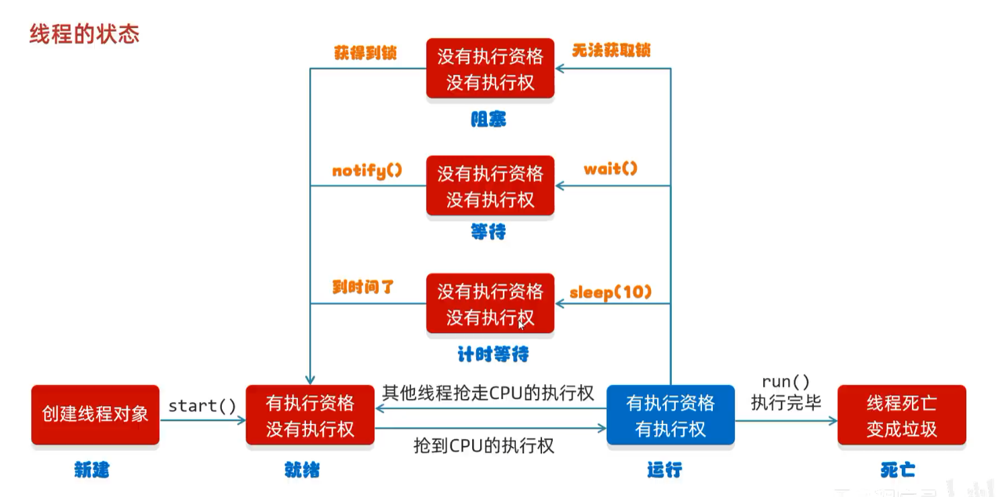

# 死锁

## 定义（背下来）

> **死锁是指两个或者两个以上的线程在执行的过程中，因争夺资源产生的一种互相等待的现象。**&#8203;

翻译成人话：
> **你拿着我的东西，我拿着你的东西，两个人都在等对方先给 —— 谁都给不了。**&#8203;

解决方法：不要让锁嵌套

---

## 课件代码（就是这个坑）

```java
public class MyThread extends Thread {
    // ⚠️ 两把锁都必须是 static，保证所有线程是同一把
    static Object objA = new Object();
    static Object objB = new Object();

    @Override
    public void run() {
        while (true) {
            if ("线程A".equals(getName())) {
                synchronized (objA) {
                    System.out.println("线程A拿到了A锁，准备拿B锁");
                    synchronized (objB) {
                        System.out.println("线程A拿到了B锁，执行完一轮");
                    }
                }
            } else if ("线程B".equals(getName())) {
                synchronized (objB) {
                    System.out.println("线程B拿到了B锁，准备拿A锁");
                    synchronized (objA) {
                        System.out.println("线程B拿到了A锁，执行完一轮");
                    }
                }
            }
        }
    }
}
```

# 等待唤醒机制（生产者 & 消费者模型）

## 是什么

> **等待唤醒机制 = 让多个线程"轮流干活、互相叫醒"，而不是一直抢 CPU 空转。**&#8203;
> 它的经典应用就是**生产者消费者模型**。

### 三个角色（背下来）

| 角色 | 作用 | 课件的例子 |
|---|---|---|
| **生产者** | 负责生产数据 | 厨师（做面） |
| **消费者** | 负责消费数据 | 吃货（吃面） |
| **中间容器（桌子）**&#8203; | 存放数据，起**缓冲**作用 | 桌子 + `foodFlag` 标志位 |

> **关键：生产者和消费者不直接打交道，都只跟"桌子"打交道** —— 这就是**解耦**。

---

## 三个核心方法（⚠️ 在 `Object` 类里！）

| 方法 | 说明 |
|---|---|
| `void wait()` | 让**当前线程等待**，直到被唤醒 |
| `void notify()` | **随机**唤醒一个正在等待的线程 |
| `void notifyAll()` | 唤醒**所有**正在等待的线程 |

### ⚠️ 重点 1：它们在 `Object` 里，不是 `Thread` 里

**面试高频题：为什么 `wait/notify` 定义在 `Object`，而不是 `Thread`？**

> 因为**它们必须由"锁对象"来调用**，而 Java 里**任何对象都能当锁**。
> 既然锁可以是任意对象，那就只能把这两个方法放到所有类的祖宗 `Object` 身上。

```java
synchronized (Desk.lock) {
    Desk.lock.wait();        // ✅ 用"锁对象"调，不是 Thread 调
    Desk.lock.notifyAll();   // ✅ 同理
}
```
###  ⚠️重点 2：必须在同步代码块 / 同步方法里调用

java

```java
Desk.lock.wait();   // ❌ 直接抛 IllegalMonitorStateException
```

**因为 `wait()` 要释放锁，你得先拿到锁才有得放。**


## 完整代码（课件版）

### ① 桌子 Desk（共享数据）

java

```java
public class Desk {
    public static int foodFlag = 0;              // 0=桌上没面  1=桌上有面
    public static int count = 10;                // 吃货还能吃 10 碗
    public static Object lock = new Object();    // 锁对象（也是"等待池"）
}
```
### ② 生产者 Cook（厨师）

java

```java
public class Cook extends Thread {
    @Override
    public void run() {
        while (true) {
            synchronized (Desk.lock) {
                if (Desk.count == 0) {
                    break;                      // 吃货吃饱了，收工
                }

                if (Desk.foodFlag == 1) {
                    // 桌上有面 → 不用做，等吃货吃完叫我
                    try {
                        Desk.lock.wait();
                    } catch (InterruptedException e) {
                        e.printStackTrace();
                    }
                } else {
                    // 桌上没面 → 做饭
                    System.out.println("厨师做了一碗面条");
                    Desk.foodFlag = 1;
                    Desk.lock.notifyAll();      // 叫醒吃货
                }
            }
        }
    }
}
```
### ③ 消费者 Foodie（吃货）

java

```java
public class Foodie extends Thread {
    @Override
    public void run() {
        while (true) {
            synchronized (Desk.lock) {
                if (Desk.count == 0) {
                    break;
                }

                if (Desk.foodFlag == 0) {
                    // 桌上没面 → 等厨师做好叫我
                    try {
                        Desk.lock.wait();
                    } catch (InterruptedException e) {
                        e.printStackTrace();
                    }
                } else {
                    // 桌上有面 → 开吃
                    Desk.count--;
                    System.out.println("吃货还能吃" + Desk.count + "碗");
                    Desk.foodFlag = 0;
                    Desk.lock.notifyAll();      // 叫醒厨师
                }
            }
        }
    }
}
```
### ④ 测试类

java

```java
public class Demo {
    public static void main(String[] args) {
        Cook c = new Cook();
        Foodie f = new Foodie();

        c.setName("厨师");
        f.setName("吃货");

        c.start();
        f.start();
    }
}
```


# 等待唤醒机制（阻塞队列方式实现）

## 课件原话（背下来）

| 操作 | 说明 |
|---|---|
| **put 数据时** | **放不进去，会等着**，也叫做**阻塞** |
| **take 数据时** | **取出第一个数据，取不到会等着**，也叫做**阻塞** |

> **一句话：阻塞队列 = 自带等待唤醒机制的队列。**&#8203;
> put 满了自动等，take 空了自动等 —— **wait / notifyAll 的活它全包了。**&#8203;

---

## 先搞懂"队列"的两端

| 端 | 谁在用 | 方法 |
|---|---|---|
| **队尾（右边）**&#8203; | 生产者（厨师） | `put()` 放数据 |
| **队头（左边）**&#8203; | 消费者（吃货） | `take()` 取数据 |

> **先进先出（FIFO）**&#8203;：厨师先放的，吃货先吃到。

---

## 核心方法（只有两个会阻塞！）

| 方法 | 作用 | 队列满 / 空时 |
|---|---|---|
| **`put(E e)`** | 把元素放到**队尾** | 满 → **阻塞等待** ⏸️ |
| **`take()`** | 取出**队头**元素并删除 | 空 → **阻塞等待** ⏸️ |
| `add(E e)` | 添加元素 | 满 → **抛异常** `IllegalStateException` |
| `offer(E e)` | 添加元素 | 满 → **返回 `false`** |
| `poll()` | 取出队头元素 | 空 → **返回 `null`** |
| `peek()` | 看一眼队头，**不删除** | 空 → 返回 `null` |

> ⚠️ **这是本节最容易考的点：只有 `put` / `take` 会阻塞，其他几个都是"立刻返回结果"。**&#8203;

**记忆方法**：
put / take → 会等（阻塞）  
add / offer / poll / peek → 不等，立刻告诉你成没成


---

## 常用实现类

| 类 | 底层结构 | 有没有界 |
|---|---|---|
| **`ArrayBlockingQueue`** | 数组 | ✅ **有界**（必须指定容量） |
| **`LinkedBlockingQueue`** | 链表 | ⚠️ 默认无界（`Integer.MAX_VALUE`，约 21 亿） |
| `SynchronousQueue` | 不存储元素 | 生产者必须**直接**交给消费者 |
| `PriorityBlockingQueue` | 堆 | 带优先级 |

> 💡 **生产环境推荐用 `ArrayBlockingQueue` 并指定容量** —— 无界队列在消费跟不上时会把内存撑爆。

---

## 完整代码（对比之前的 Desk 版本）

```java
public class Demo {
    public static void main(String[] args) {
        // 1. 创建阻塞队列，容量 1（模拟桌上只能放一碗面）
        ArrayBlockingQueue<String> queue = new ArrayBlockingQueue<>(1);

        // 2. 厨师（生产者）
        new Thread(() -> {
            while (true) {
                try {
                    queue.put("面条");                     // 队列满 → 自动阻塞
                    System.out.println("厨师放了一碗面");
                } catch (InterruptedException e) {
                    e.printStackTrace();
                }
            }
        }, "厨师").start();

        // 3. 吃货（消费者）
        new Thread(() -> {
            while (true) {
                try {
                    String food = queue.take();            // 队列空 → 自动阻塞
                    System.out.println("吃货吃了一碗" + food);
                } catch (InterruptedException e) {
                    e.printStackTrace();
                }
            }
        }, "吃货").start();
    }
}
```





# 线程的状态（Java 官方 6 种）

| 状态 | 触发条件 |
|---|---|
| 新建状态（**NEW**） | 创建线程对象 |
| 就绪状态（**RUNNABLE**） | `start` 方法 |
| 阻塞状态（**BLOCKED**） | **无法获得锁对象** |
| 等待状态（**WAITING**） | `wait` 方法 |
| 计时等待（**TIMED_WAITING**） | `sleep` 方法 |
| 结束状态（**TERMINATED**） | 全部代码运行完毕 |

> 这 6 个就是 `Thread.State` 枚举的全部取值 —— **`Thread.getState()` 只能返回这 6 个之一。**&#8203;

**Java 没有"运行状态"，是因为"是否正在使用 CPU"这件事由操作系统内核决定，JVM 无从知晓；就算知晓了，这个信息也随时会失效，且无法用于任何实际决策。**​  
**所以 Java 只提供"可运行（`RUNNABLE`）"这个粗粒度但稳定的说法。**