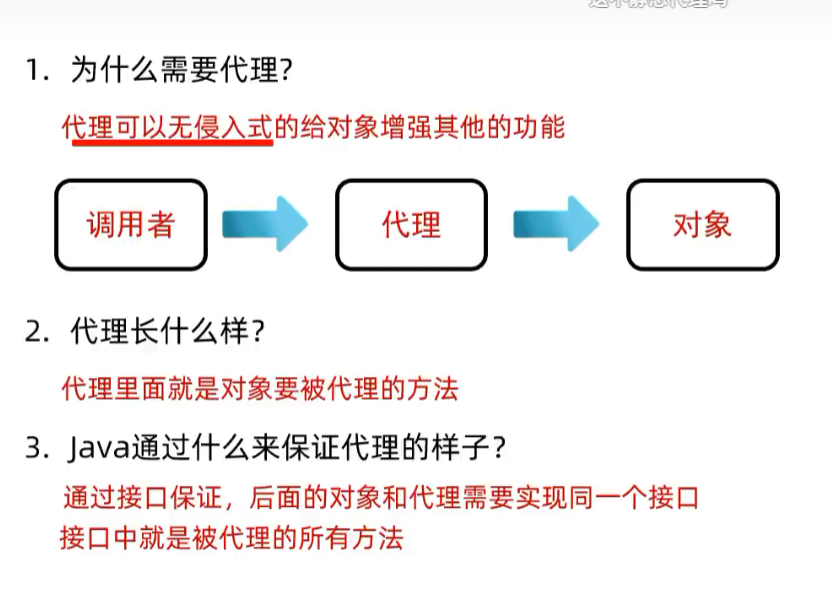

# 动态代理

## 一、什么是动态代理

- **代理**：程序运行过程中，由 JVM 动态生成一个"代理对象"，**代替原对象**去调用方法。
- **作用**：代理在调用原方法的前后，可以**加上额外的功能**（如打印日志、权限校验等）。

### 图解

原始代码：Student 类只有吃饭这件事  
┌─────────────────────────────────┐  
│ public class Student {                                            │  
│ public void eat(){                                                   │  
│ System.out.println("吃饭");                                    │
│ }                                                                             │  
│ }                                                                             │  
└─────────────────────────────────┘  
▲  
│ 代理替它"加戏"：  
① System.out.println("拿筷子"); // 调用前增强  
② System.out.println("盛饭"); // 调用前增强（准备工作）


- 学生只会"吃饭"，**代理**帮他在吃饭前做了"拿筷子、盛饭"这些准备工作。
- 原类 `Student` 的代码**一行都不用改**。

## 二、动态代理的特点

> **无侵入式地给代码增加额外的功能**

- "无侵入" = 不修改原始类的源码，就能给它的方法**加新功能**。
- 想想之前想给方法加功能怎么办？只能改源码。现在交给代理，原代码保持干净。




## 三、创建代理对象：Proxy.newProxyInstance()

`java.lang.reflect.Proxy` 类：提供了为对象**产生代理对象**的方法。

```java
public static Object newProxyInstance(ClassLoader loader, Class<?>[] interfaces, InvocationHandler h)
```

### 1. 三个参数

|参数|类型|作用|
|---|---|---|
|参数一|`ClassLoader loader`|指定用**哪个类加载器**，去加载生成的代理类|
|参数二|`Class<?>[] interfaces`|指定**接口**，指定生成的代理**长什么样**（有哪些方法）|
|参数三|`InvocationHandler h`|指定生成的代理对象**要干什么事情**（增强逻辑写在这）|
```java
public static Star createProxy(BigStar bigStar) {
    Star star = (Star) Proxy.newProxyInstance(
        ProxyUtil.class.getClassLoader(),  // 参数一：类加载器
        new Class[]{Star.class},           // 参数二：接口数组，代理要有 Star 里的方法
        new InvocationHandler() {          // 参数三：代理要干的事
            @Override
            public Object invoke(Object proxy, Method method, Object[] args) throws Throwable {
                /**
                 * 参数一：代理的对象
                 * 参数二：要运行的方法 sing
                 * 参数三：调用 sing 方法时，传递的实参
                 */
                return null;
            }
        }
    );
    return star;
}
```

### 3. 代码侧解

- **`(Star)` 强转**：`newProxyInstance` 返回值是 `Object`，因为我们知道代理实现了 `Star` 接口，所以强转回 `Star`。
- **`ProxyUtil.class.getClassLoader()`**：固定写法，随便拿一个类的类加载器都行（一般是"谁用代理，就用谁的类加载器"）。
- **`new Class[]{Star.class}`**：接口可以有多个，所以是**数组**；这里只有 `Star` 一个。
- **匿名内部类 `new InvocationHandler()`**：真正写增强逻辑的地方。

> 💡 tips：
> 
> - 背下来的口诀：**类加载器 + 接口（长什么样）+ Handler（干什么）**​，和上一页"三个问题"一一对应。
> - 返回值是 `Object` 是设计妥协——JDK 没法提前知道你传了什么接口，所以只能给 Object，由你自己强转。
> - 强转目标要写**接口类型** `Star`，不要写实现类 `BigStar`（代理和 BigStar 只是"兄弟关系"，不是父子）。


