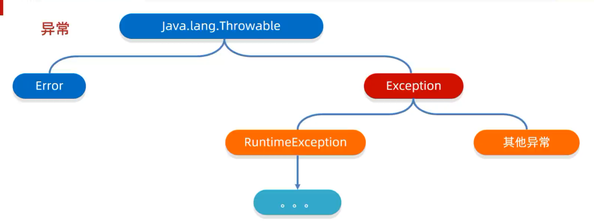
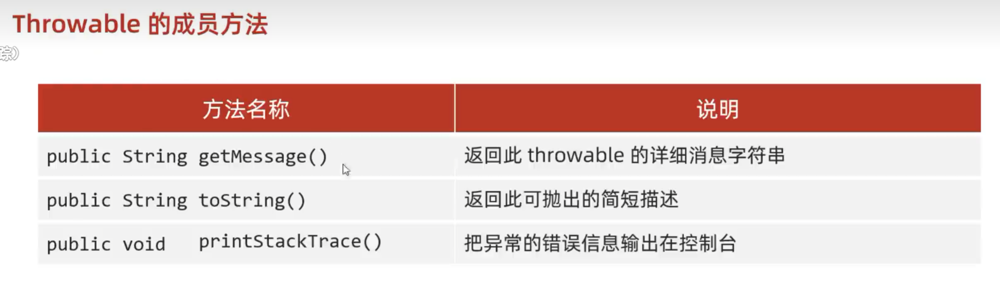

# 异常 · 入门

## 异常
异常就是代表程序出现的问题

## ⚠️ 误区
**不是让我们以后不出异常，而是程序出了异常之后，该如何处理。**&#8203;


# 异常的体系结构

## 📌 家族树（重点）



## ① Exception（异常）
代表程序可能出现的问题。我们通常会用 Exception 以及其他的子类来封装程序出现的问题。

## ② 运行时异常（RuntimeException）
RuntimeException及其子类，**编译阶段不会出现异常提醒**。

例如：
- 数组索引越界异常（`ArrayIndexOutOfBoundsException`）
- 空指针异常（`NullPointerException`）
- 类型转换异常（`ClassCastException`）
- 数字格式异常（`NumberFormatException`）

## ③ 编译时异常
**编译阶段就会出现异常提醒**，必须处理（不处理直接编译报错）。

例如：
- 日期解析异常（`ParseException`）
- 文件找不到异常（`FileNotFoundException`）
- IO 异常（`IOException`）
- 类找不到异常（`ClassNotFoundException`）


## 编译时 vs 运行时（看异常发生在哪一步）

```
Java 文件 │
   │ Javac 命令 ← 这里出错就是【编译时异常】
   ▼
字节码文件（.class）
   │
   │  Java 命令   ← 这里出错就是【运行时异常】
   ▼
运行结果
```

# 异常的作用

## 作用一：查询 bug 的关键参考信息

异常抛出时，JVM 会给你一坨**堆栈追踪信息**（哪个类、哪个方法、第几行出错），这就是排错的"线索"。

示例：遇到 `ArrayIndexOutOfBoundsException: Index 5 out of bounds for length 3`

→ 你就知道是**数组下标 5 越界了**，数组长度只有 3。

---

## 作用二：作为方法内部的"特殊返回值"，通知调用者底层执行情况

调用方法后，方法可能**没法用正常返回值**告诉你"我执行失败了"（比如读取文件、解析日期），
这时候就 **抛个异常** 出来。

经典场景：

```java
// 用户传的年龄不合法
public void setAge(int age) {
    if (age < 0 || age > 150) {
        throw new RuntimeException("年龄不合法：" + age);
    }
    this.age = age;
}
```

调用者通过**捕获异常**就能知道"哦，这个人年龄不合法"，不用看返回值。


# 异常的处理方式（3 种）

```
┌─ ① JVM 默认的处理方式     （程序崩了 +打印堆栈）
├─ ② 自己处理               （try...catch，接住异常，自己搞定）
└─ ③ 抛出异常                （throws甩锅 / throw 手动抛）
```

---

### 3 种方式一句话速览

| # | 方式 | 谁来干 | 适用场景 |
|---|------|-------|---------|
| ① | **JVM 默认** | JVM帮我们处理 | 不写任何代码时（**不推荐**）|
| ② | **自己处理** | 程序员写 `try...catch` | 想"接住异常并恢复"（**最常用**）|
| ③ | **抛出异常** | 程序员写 `throws` 或 `throw` | 想"把异常甩出去"给别人处理 |

---

## 自己处理异常（捕获异常）

### 格式

```java
try {
    可能出现异常的代码;
} catch(异常类名 变量名) {
    异常的处理代码;
}
```

### 好处

**可以让程序继续往下执行，不会停止。**&#8203;

（对比：JVM 默认处理方式会**直接终止程序**，从异常那行开始后面的都不跑了）

---

### 💡 一个完整示例看懂它

```java
int[] arr = {1, 2, 3};

try {
    System.out.println(arr[10]);   // 这里会抛数组越界异常
} catch (ArrayIndexOutOfBoundsException e) {
    System.out.println("数组越界啦！");
}

System.out.println("程序结束"); // 这行还能跑 ✅
```

**运行结果**：
数组越界啦！  
程序结束


# 自己处理（捕获异常）灵魂四问

## 1、灵魂一问：如果 try 中没有遇到问题，怎么执行？

**会把 try里面所有的代码全部执行完毕，不会执行 catch 里面的代码。**&#8203;

> ⚠️ 注意：只有当出现了异常**才会执行** catch 里面的代码。
>
> 换句话说：没异常就**完全跑过 try**，catch 只是个"摆烂的急救站"，用不上就一直闲置。

---
## 2、灵魂二问：如果 try 中可能会遇到多个问题，怎么执行？

**会写多个 catch 与之对应。**&#8203;

>  ⚠️ 细节（最容易犯的错）
>  
> 如果我们要捕获多个异常，这些异常中如果存在**父子关系**的话，那么**父类一定要写在下面**。

原因：catch 是按顺序匹配的。如果父类异常放前面，子类异常会被父类 catch 直接接住，**子类的 catch 永远走不到**。


### 🚀 JDK 7+ 简写：用 `|` 同时接多个异常

如果多个 catch 体里**逻辑完全一样**，可以用 `|` 合写：

```java
try {
    System.out.println(arr[10]);
} catch (ArrayIndexOutOfBoundsException | NullPointerException e) {  // 多异常用 | 隔开
    System.out.println("数组越界或空指针");
}
```

> 注意：这种写法**默认就有 final 修饰**，不能用 `e = xxx` 重新赋值。
> 优势：省代码 + **不需要考虑父子关系**（因为左右两边都是平级异常）

---

## 3、灵魂三问：如果 try 中遇到的问题没有被捕获，怎么执行？

**相当于 try...catch 的代码白写了，最终还是会交给虚拟机进行处理。**&#8203;

---

## 4、灵魂四问：如果 try 中遇到了问题，那么 try 下面的其他代码还会执行吗？

**下面的代码就不会执行了，直接跳转到对应的 catch 当中，执行 catch 里面的语句体。**&#8203;

**但是如果没有对应 catch 与之匹配，那么还是会交给虚拟机进行处理。**&#8203;


# Throwable 的成员方法



| 方法名                             | 说明                      |
| ------------------------------- | ----------------------- |
| `public String getMessage()`    | 返回此 throwable 的详细消息字符串  |
| `public String toString()`      | 返回此可抛出的简短描述             |
| `public void printStackTrace()` | 把异常的错误信息输出在控制台，不会停止程序运行 |

# 抛出处理：throws vs throw（高频考点）

## 一图对比

| | **throws**（带 s）| **throw**（不带 s）|
|---|---|---|
| **位置** | 写在**方法定义处**（方法签名上） | 写在**方法内**（方法体里） |
| **作用** | **声明**异常（告诉调用者"我可能抛这些异常"） | **手动抛出**异常对象 |
| **后面跟** | `异常类名1, 异常类名2...` | `new异常对象` |
| **效果** | 调用者必须处理（try catch 或继续抛） | **结束方法**，下面的代码不执行 |

---

## 格式对照

```java
// throws：写在方法签名
public void 方法() throws 异常类名1, 异常类名2 ... {
    // ...
}

// throw：写在方法体里
public void 方法() {
    throw new NullPointerException(); // 手动抛一个空指针异常
}
```

---

## ⚠️ 关键规则- **编译时异常：必须要写**（不写 → 编译报错）
- **运行时异常：可以不写**（写了也行，但不强制）

---

## 💡 实战例子

```java
// throws：声明本方法可能抛 IOException（编译时异常，必须写）
public static void readFile(String path) throws IOException {
    FileInputStream fis = new FileInputStream(path);  // 这行就可能抛 IOException
    // ...
}

// throw：手动抛个业务异常
public static void setAge(int age) {
    if (age < 0 || age > 150) {
        throw new RuntimeException("年龄不合法：" + age);
    }
}
```


# 自定义异常

## 4 步流程（黑马最爱的步骤）

1. **定义异常类**
2. **写继承关系**（继承 `Exception` 或 `RuntimeException`）
3. **空参构造**（无参构造方法）
4. **带参构造**（接 String 消息，调用 `super(message)`）

## 意义

**让控制台的报错信息更加见名知意。**&#8203;


### 第 1-2 步：定义异常类 + 写继承关系

```java
public class AgeOutOfRangeException extends RuntimeException {
    // 3. 空参构造
    public AgeOutOfRangeException() {
    }
    
    // 4. 带参构造
    public AgeOutOfRangeException(String message) {
        super(message); // 把消息传给父类 RuntimeException
    }
}
```

### 使用场景（自定义异常咋用？）
```java
public class Student {
    private int age;

    public void setAge(int age) {
        if (age < 0 || age > 150) {
            throw new AgeOutOfRangeException("年龄超范围：" + age);
        }
        this.age = age;
    }
}

// 调用Student s = new Student();
s.setAge(200); // 抛 AgeOutOfRangeException，控制台显示：
// AgeOutOfRangeException: 年龄超范围：200
```
